<table width=100% border=>
<tr><td colspan=2><h1>EXERCISE 1_2 - BUILDING A PROJECT WITH THE CF ARCHETYPE</h1></td></tr>
<tr><td><h3>SAP Partner Workshop</h3></td><td><h1> &nbsp;30 min</h1></td></tr>
</table>


## Description
In this exercise, you’ll learn how 

* to install and configure Eclipse IDE
* to create a SAP S/4HANA Cloud SDK project for Cloud Foundry from an archetype using the Eclipse IDE
* to build the project with Eclipse IDE
* to deploy the application to your Cloud Foundry environment

For further reading on S/4HANA Cloud SDK, click link below.
<https://www.sap.com/germany/developer/topics/s4hana-cloud-sdk.html>


## Target group

* Developers
* People interested in learning about S/4HANA extension and SDK  


## Goal

The goal of this exercise is to create a Maven project for Cloud Foundry starting from the scp-cf-tomee archetype made available with the SAP S/4HANA Cloud SDK.


## Prerequisites
  
Here below are prerequisites for this exercise.

* A trial account on the SAP Cloud Platform. You can get one by registering here <https://account.hanatrial.ondemand.com>
* Apache Maven
* Java JDK 8


## Steps

1. [Create your first project](#project-creation)
1. [Deploy the app to Cloud Foundry](#deploy-to-cf)
1. [Switch from random to fixed route](#fixed-route)

### <a name="project-creation"></a> Create your first project
In this chapter you are going to create your first project using the S/4HANA Cloud SDK. This is just a "Hello World" project, which means that it's just a very basic Java application serving a page which displays a simple "Hello World" message. Let's start with this and you will learn how to modify this project in the next exercises.

1. Before you start please connect with your SAP Cloud Platform and get your UserID by clicking on your user name in the top right corner 
	

2. Write down this ID since it will be used along with the next steps and the next exercises. Use it when asked for your **\<SAP\_CP\_USER\_ID\>**  
	

1. Now, launch Eclipse IDE

1. Go to **File -> New -> Project...**  
	

1. Select **Maven -> Maven Project** and click **Next**  
	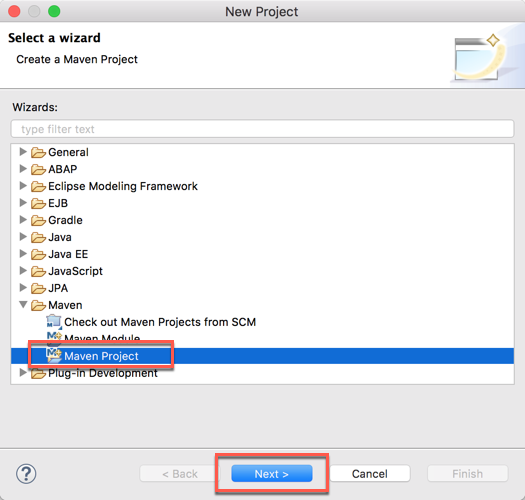

1. Click on **Next**  
	

1. Since this is the first time we use the SDK we need to configure the Maven Central repository in Eclipse. Click **Configure**   
	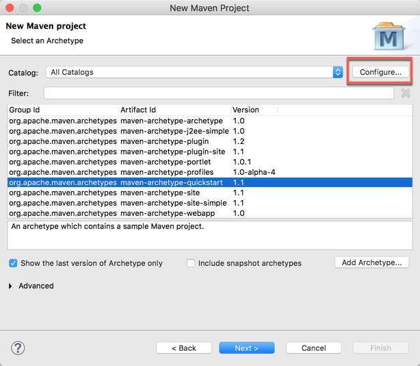

1. Click **Add Remote Catalog...**   
	

1. Enter the following values and ckick **OK**   

   Parameter			| Value   
	-------------		| -------------   
	Catalog File		| http://repo1.maven.org/maven2/   
	Description		| S4HANA Cloud SDK   

 	

1. A new remote repository has been added, click on **Apply and Close**   
	

1. Type the text "**s4hana**" in the filter box and select the **scp-cf-tomee** artifact, then click **Next**   
	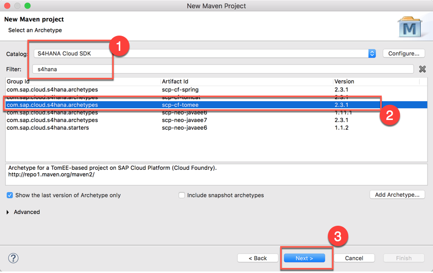

1. Set the following values replacing **xx** with the identifier received by your instructor and click **Finish**  

   Parameter 			| Value   
	-------------		| -------------   
	Group Id  		| com.sap.sample   
	Artifact Id		| bpr\_cf\_\<SAP\_CP\_USER\_ID\>
	Version			| 0.0.1-SNAPSHOT

 	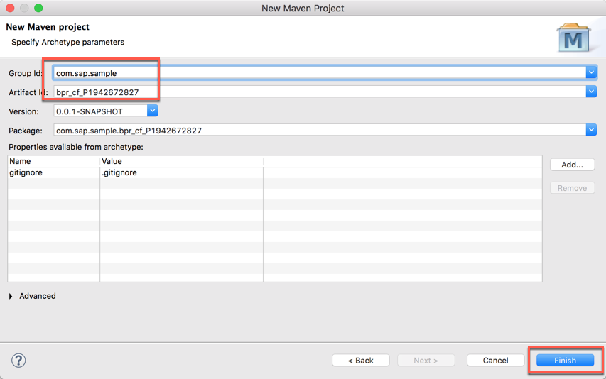
	
1. The project is created. Once done, expand the **application** module and give a look to the *HelloWorldServlet.java* file located under the path *src/main/java/com/sap/sample/\<artifact_id\>*. This is your servlet: it will answer when you will call you application URL with the "/hello" endpoint (line 14). The answer will be a web page containing just the text "Hello World" (line 25)  
 	

1. Let's build this application. Expand the **root** module and right click on the *pom.xml* file. Select **Run As -> Maven build**  
	

1. If required, enter the goals "clean install" and click **Run**  
	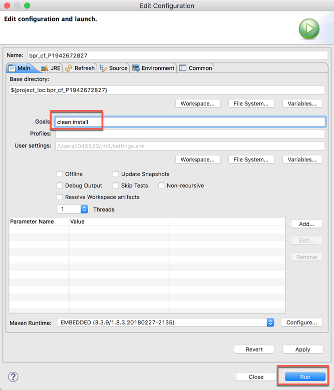

1. The project is built and you should receive a "BUILD SUCCESS" message  
	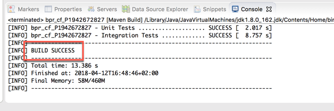


### <a name="deploy-to-cf"></a> Deploy the app to Cloud Foundry
Let's push the application to Cloud Foundry.

1. Login to your [SAP Cloud Platform Trial Landscape](https://account.hanatrial.ondemand.com/cockpit) and click on the **Cloud Foundry Trial** tile  
	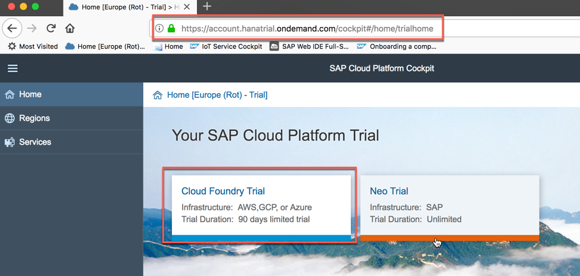

1. Click on the **trial** subaccount  
	

1. Write down or copy in the clipboard the endpoint to your Cloud Foundry space, since it will be required in the next steps. Then click on the small **1** indicating the number of available spaces: this will bring you to the list of all your spaces  
	

1. Click on the **dev** space (this is the default space assigned to you when you create an account on the Trial Landscape)  
	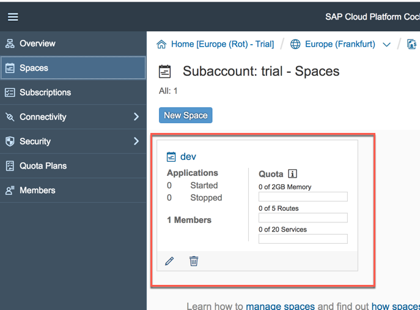

1. At moment your space does not contain any application yet  
	

1. Open your Terminal or Command Prompt and navigate to the folder where the project is located. For example, mine is under *\<HOME\>Workspaces/Eclipse/workspace01/bpr\_cf\_\<SAP\_CP\_USER\_ID\>*    
	

1. Enter the command

	```sh
	cf api <your_api_endpoint>
	```
where **\<your\_api\_endpoint\>** is the link you copied in the previous step
	

1. You can now login to Cloud Foundry with the command. You will have to enter the email you used to register to the SAP CP Trial Landscape with its password

	```sh
	cf login
	```	
	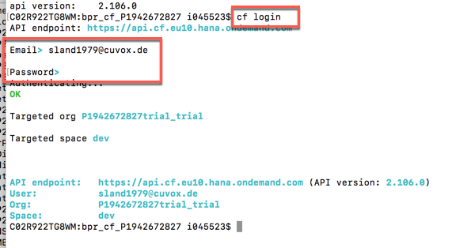

1. Make also sure that there are no other applications running in your CF environment so that you have plenty of space for this exercise  
	

1. Enter the command `cf push` to deploy the application to your CF environment. At the end of the process you should get a status of "running" for your application and you should be also able to read the automatically generated random route for accessing it  
	

1. At the same way, you can check the result by accessing your SAP Cloud Foundry cockpit. You should see a new application in your space: click on the  application name  
	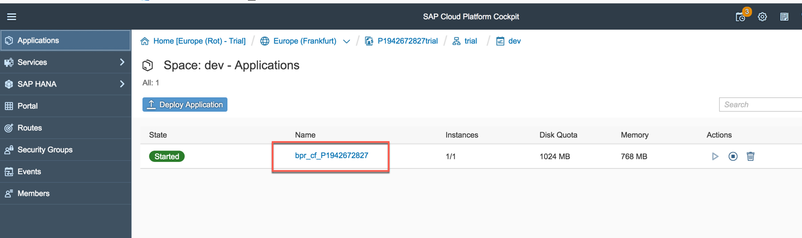

1. You will get a lot of other important details about your running application. Among those details, you will find the application route (the same you have seen in the Terminal two steps ago). Click on this route link and the application's landing page will be opened  
	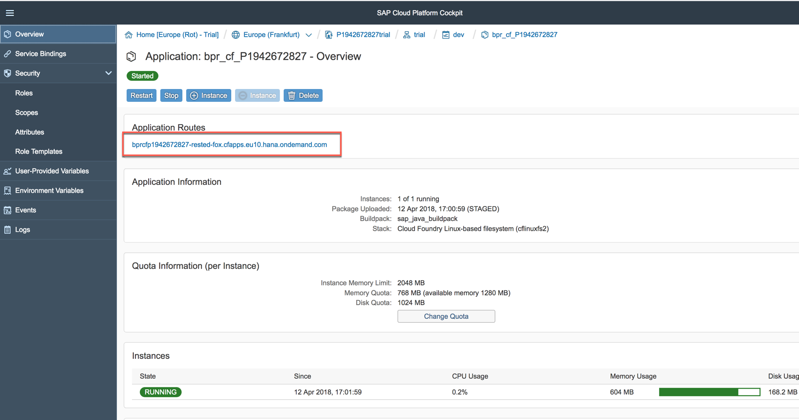

1. The application's landing page is just a standard Tomcat welcome screen. Click on the **HelloWorldServlet** link  
	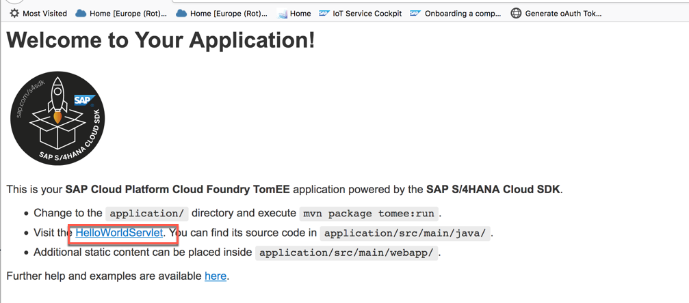

1. The service you defined within the Java application is shown  
	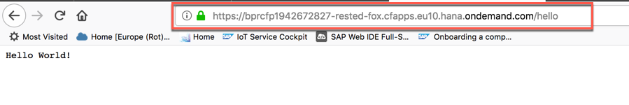

1. You have successfully created your CF application with Eclipse IDE.


### <a name="fixed-route"></a> Switch from random to fixed route
Before we close this exercise we need to make one last important change: we need to get rid of the random route and create a fixed route for our application. When you create the application starting from the archetype it's configured to receive a random route from the system, so that, all the users pushing an application, can get a different path/URL to their apps. This is a good thing, of course, but if you delete an application and you push it again, it will receive a new route, which is different from the previous one. If this is not important here, it will be in the exercise where we are going to manage the Cloud Foundry Security through the Approuter component. The Approuter needs to point always to the same application URL otherwise it stops working. Of course, the application URLs will be still different for each user. You will better understand this later in this workshop.

1. Copy the application URL the system generated for you, the one you used to access the "/hello" endpoint, and paste it in a text editor. Then remove the following parts of this string:
	- "https://"
	- the random name
	- the "/hello" endpoint

	Keep this string at hand because it will be used later
	
	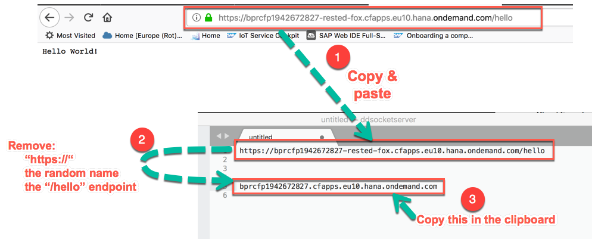

1. Go to Eclipse IDE 

1. Expand the **root** module and double click on the *manifest.yml* file: this is the file which contains the information about how the Cloud Foundry application must be configured  
	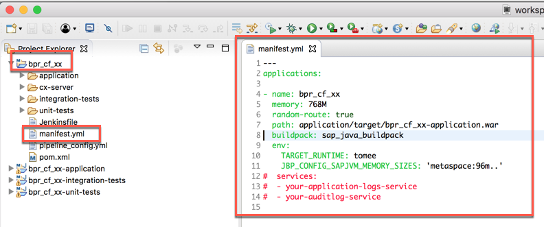

1. As you can see, there is a line containing the following setting:

	```yml
  	random-route: true
	```
	
	Replace this line with the following block; also replace the **\<NEW\_ROUTE\>** variable with the string you have got in the first step of this section
	
	```yml
	routes:
	- route: <NEW_ROUTE>
	```
	
	
	
	>NOTE: Please pay particular attention to the formatting of this file because YML files are sensitive to the indentation.

1. Save the file

1. Go to SAP CP Cloud Foundry cockpit and **delete** the existing application  
	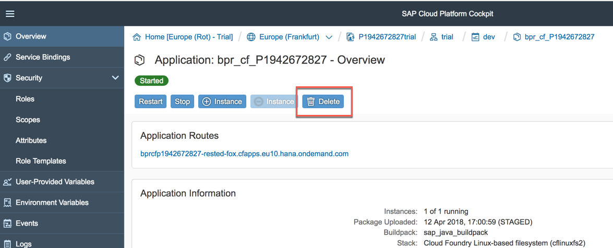

1. Confirm the deletion  
	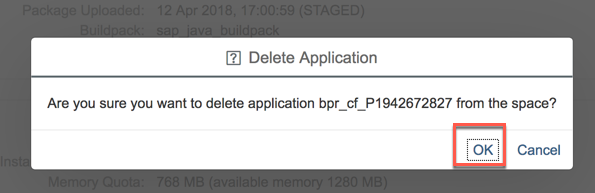

1. Check that you don't have any application in your space  
	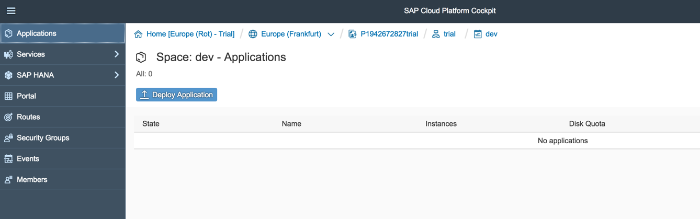

1. Go back to your Terminal window and **push** the application again. The new route has been applied; you can check this from the "routes" variable  
	

1. You can now access your application through this new route. From this moment on, this will be your **\<APPLICATION\_URL\>**  
	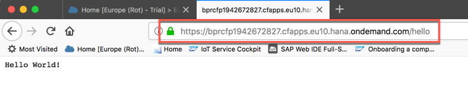

1. You have successfully replaced your random route with a fixed route.


## Summary
This concludes the exercise. You should have learned how to install and configure Eclipse IDE in order to create a SAP S/4HANA Cloud SDK project for Cloud Foundry from a Maven archetype. You have also learned how to build the project with this new IDE and how to deploy the application to your Cloud Foundry environment. Please proceed with the next exercise.
