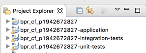
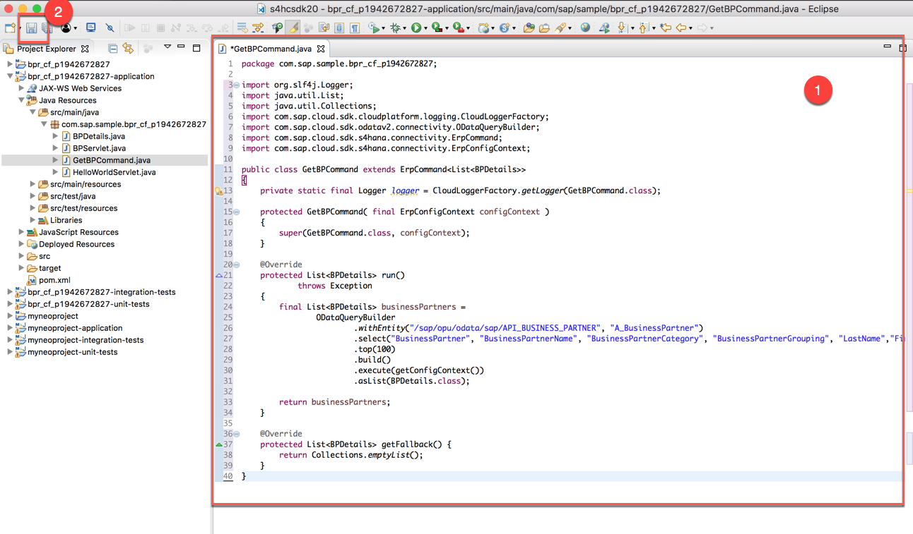
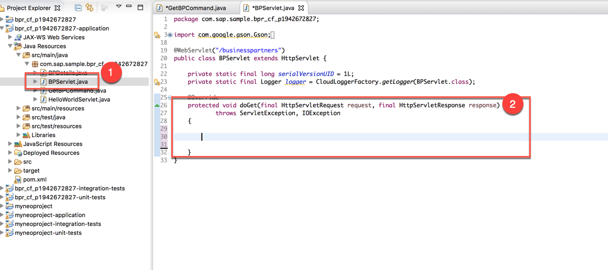
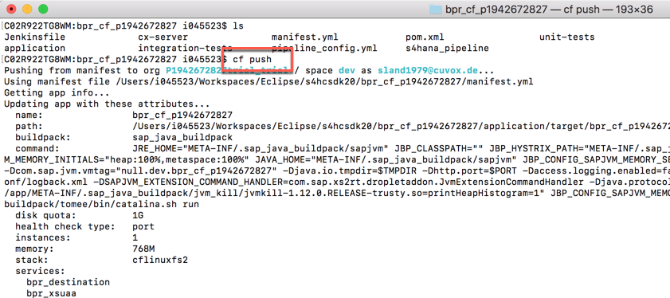
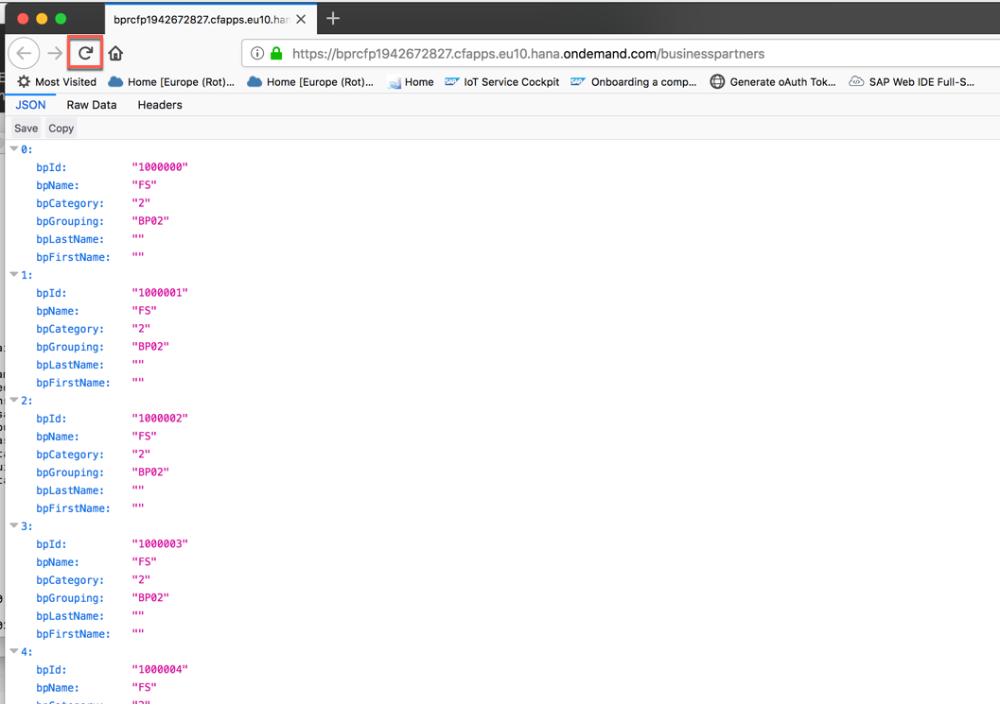
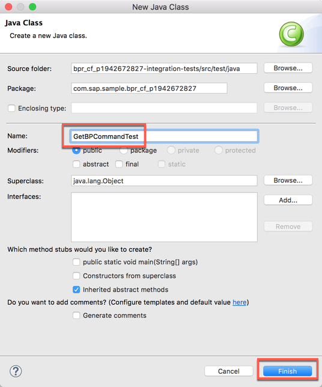
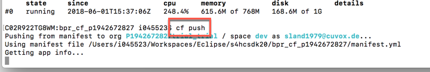

<table width=100% border=>
<tr><td colspan=2><h1>EXERCISE 1_6 - MAKE THE APPLICATION RESILIENT</h1></td></tr>
<tr><td><h3>SAP Partner Workshop</h3></td><td><h1> &nbsp;30 min</h1></td></tr>
</table>


## Description
In this exercise, you’ll learn how 

* to make the application resilient
* to adapt the integration tests accordingly

**Resiliency** is the ability to deal with failure: if an application can deal with failures, we call it resilient. So resilience is the means by which we achieve availability.
The SAP S/4HANA Cloud SDK builds upon the [Hystrix](https://github.com/Netflix/Hystrix/wiki) library in order to provide resilience for your cloud applications. Hystrix comes with many interlocking mechanisms to protect your application from failures. The most important are timeouts, thread-pools and circuit-breakers.

- **Timeouts**: Hystrix allows setting custom timeout durations for every remote service. If the response time of a remote service exceeds the specified timeout duration, the remote service call is considered as failure. This value should be adapted according to the mean response time of the remote service
- **Thread-pools**: By default, every command has a separate thread-pool from which it can requests threads to execute the remote service call in. This has multiple benefits: every command is isolated from your application, so whatever happens in these threads will not affect the performance of your application. Also, the usage of threads allows Hystrix to perform remote service calls asynchronously and concurrently. These threads are non-container-managed, so regardless of how many threads are used by your Hystrix commands, they do not interfere with your runtime container.
- **Circuit breaker**: Hystrix uses the circuit breaker pattern to determine whether a remote service is currently available. Breakers are closed by default. If a remote service call fails too many times, Hystrix will open/trip the breaker. This means that any further calls that should be made to the same remote service, are automatically stopped. Hystrix will periodically check if the service is available again, and open the closed breaker again accordingly.

For further reading on S/4HANA Cloud SDK, click link below.
<https://www.sap.com/germany/developer/topics/s4hana-cloud-sdk.html>


## Target group

* Developers
* People interested in learning about S/4HANA extension and SDK  


## Goal

The goal of this exercise is make this application resilient using the Hystrix framework.  

## Prerequisites
  
Here below are prerequisites for this exercise.

* A trial account on the SAP Cloud Platform. You can get one by registering here <https://account.hanatrial.ondemand.com>
* Apache Maven
* Java JDK 8
* The source code created in the previous exercise
* A S/4HANA system with a working communication arrangment for the Business Partners collection


## Steps

1. [Make the application resilient](#make-resilient)
1. [Adapt the integration tests accordingly](#adapt-integration-tests)


### <a name="make-resilient"></a> Make the application resilient
In this chapter you are going to see how to make the application resilient. In the previous exercise we created a simple servlet that uses the SDK’s OData abstractions to retrieve Business Partners from a S/4HANA Cloud system. In order to make this servlet resilient, we have to wrap it in an **ErpCommand**. 

1. Open Eclipse IDE and load the project created in the previous exercise  
	

1. Right click on the the **application** module and select **New -> Class**  
	

1. Create a new Java class named **GetBPCommand** and click **Finish**  
	

1. Replace the **GetBPCommand** class with the following code and **save** the file (don't change the first line which contains the package name). As you can see here we are wrapping the same query we have in the BPServlet class into an ErpCommand. The GetBPCommand class inherits from ErpCommand, which is the SDK’s abstraction to provide easy to use Hystrix commands. To implement a valid ErpCommand we need to
	- **provide a constructor**: here we simply add a constructor that takes an ErpConfigContext as parameter
	- **override the run() method**: again, we can simply use the code we used to call our OData service in the previous exercise, and put it into the run() method. No changes are needed!

	Additionally, by overriding the **getFallback()** method, we can provide a fallback if the remote service call should fail. In this case we simply return an empty list. We could also serve static data or check wether we have already cached a response to this call.

	```java
	import org.slf4j.Logger;	
	import java.util.List;
	import java.util.Collections;
	import com.sap.cloud.sdk.cloudplatform.logging.CloudLoggerFactory;
	import com.sap.cloud.sdk.odatav2.connectivity.ODataQueryBuilder;
	import com.sap.cloud.sdk.s4hana.connectivity.ErpCommand;
	import com.sap.cloud.sdk.s4hana.connectivity.ErpConfigContext;
	
	public class GetBPCommand extends ErpCommand<List<BPDetails>>
	{
	    private static final Logger logger = CloudLoggerFactory.getLogger(GetBPCommand.class);
	
	    protected GetBPCommand( final ErpConfigContext configContext )
	    {
	        super(GetBPCommand.class, configContext);
	    }
	
	    @Override
	    protected List<BPDetails> run()
	            throws Exception
	    {
	        final List<BPDetails> businessPartners =
	                ODataQueryBuilder
	                        .withEntity("/sap/opu/odata/sap/API_BUSINESS_PARTNER", "A_BusinessPartner")
	                        .select("BusinessPartner", "BusinessPartnerName", "BusinessPartnerCategory", "BusinessPartnerGrouping", "LastName","FirstName")
	                        .top(100)
	                        .build()
	                        .execute(getConfigContext())
	                        .asList(BPDetails.class);
	
	        return businessPartners;
	    }
	
	    @Override
	    protected List<BPDetails> getFallback() {
	        return Collections.emptyList();
	    }
	}
	```
	

1. Now we need to adapt the old **BPServlet** class to use this new command. Open the *BPServlet.java* class. Select the entire content of the **doGet** method and delete it  
	

1. In the **doGet** method, paste the following content

	```java
    final ErpConfigContext configContext = new ErpConfigContext();
    final List<BPDetails> result = new GetBPCommand(configContext).execute();

    response.setContentType("application/json");
    response.getWriter().write(new Gson().toJson(result));
	
	```
	
	

1. Expand the list of imports and feel free to remove the unused ones if you like  
	

1. This is how the final *BPServlet* file should look like. Remember to save the file
	
	
1. Expand the **root** module of your project and select the *pom.xml* file. Then click on the small play button on the toolbar. Select the **Maven build** goal and click **OK**  
	

1. Specify the **clean install** goals if required and click **Run**  

1. Building should end with a BUILD SUCCESS message  
	

1. Click on the Terminal pane and type in the `cf push` command to deploy the application to Cloud Foundry  
	

1. Refreshing the browser page where you have your application URL, you should be still able to see the Business Partners list  
	

1. You have successfully implemented resilience in your application using the S/4HANA Cloud SDK.


### <a name="adapt-integration-tests"></a> Adapt the integration tests accordingly
In this chapter you are going to implement a new Java class to test the GetBPCommand we have created in the previous chapter.

1. In Eclipse IDE, right click on the **integration-tests** module and choose **New -> Class**  
	

1. Create a new Java Class named **GetBPCommandTest** and click **Finish**  
	

1. Replace the **GetBPCommandTest** class with the following code and **save** the file (don't change the first line which contains the package name)

	```java
	import org.junit.BeforeClass;
	import org.junit.Test;
	import java.util.Collections;
	import java.util.List;
	import java.util.Locale;
	import com.sap.cloud.sdk.cloudplatform.servlet.Executable;
	import com.sap.cloud.sdk.cloudplatform.servlet.RequestContextExecutor;
	import com.sap.cloud.sdk.s4hana.connectivity.ErpConfigContext;
	import com.sap.cloud.sdk.s4hana.connectivity.ErpDestination;
	import com.sap.cloud.sdk.s4hana.serialization.SapClient;
	import com.sap.cloud.sdk.testutil.MockUtil;
	import static org.assertj.core.api.Assertions.assertThat;
	
	public class GetBPCommandTest {
	
	    private static final MockUtil mockUtil = new MockUtil();
	    private static final RequestContextExecutor requestContextExecutor = new RequestContextExecutor();
	
	    @BeforeClass
	    public static void beforeClass()
	    {
	        mockUtil.mockDefaults();
	        mockUtil.mockErpDestination();
	    }
	
	    private List<BPDetails> getBusinessPartners(final String destination, final SapClient sapClient) {
	        final ErpConfigContext configContext =
	                new ErpConfigContext(destination, sapClient, Locale.ENGLISH);
	
	        return new GetBPCommand(configContext).execute();
	    }
	
	    @Test
	    public void testWithSuccess() throws Exception {
	        requestContextExecutor.execute(new Executable() {
	            @Override
	            public void execute() throws Exception {
	                assertThat(getBusinessPartners(ErpDestination.getDefaultName(), mockUtil.getErpSystem().getSapClient())).isNotEmpty();
	            }
	        });
	    }
	
	    @Test
	    public void testWithFallback() throws Exception {
	        requestContextExecutor.execute(new Executable() {
	            @Override
	            public void execute() throws Exception {
	                assertThat(getBusinessPartners("NoErpSystem", mockUtil.getErpSystem().getSapClient())).isEqualTo(Collections.emptyList());
	            }
	        });
	    }
	}
	```
	

We use JUnit’s **@BeforeClass** annotation to setup our mockUtils and to mock the ERP destinations. In the tests (@Test) we do the following: first we create a new request context using mockUtil.requestContextExecutor and provide it with a new Executable; then we override the Executable’s execute() method, where we finally put the code that we actually want to test together with the corresponding assertions.  
	- For **testWithSuccess()**, we correctly provide the default ERP destination information using mockUtil. For the sake of simplicity we simply assert that the response is not empty.  
	- For **testWithFallback()**, we intentionally provide a not existing destination in order to make the command fail. Since we implemented a fallback for our command that returns an empty list, we assert that we actually receive an empty list as response.

1. Build the application again  
	

1. At the end of the execution, you should receive a BUILD SUCCESS message. Of course this operation also performs the required integration tests  
	

1. Run again a `cf push` command to Cloud Foundry  
	

1. Check that the application is still providing the expected results  
	

1. Congratulations! You have successfully implemented integration tests into your application using the S/4HANA Cloud SDK.


## Summary
This concludes the exercise. You should have learned how implement Hystrix resilience in your application and add a further integration test for the new implemented class. Please proceed with the next exercise.

