<table width=100% border=>
<tr><td colspan=2><h1>EXERCISE 1_8 - SECURING YOUR CLOUD FOUNDRY APPLICATION</h1></td></tr>
<tr><td><h3>SAP Partner Workshop</h3></td><td><h1> &nbsp;60 min</h1></td></tr>
</table>


## Description
In this exercise, you’ll learn how to 

* introduce authentication into your application using the SAP Approuter component
* protect your Java microservice so that it only accepts requests based on a valid JSON Web Token (JWT), received from the Approuter
* assign roles and scopes to your application users and let your back-end deal with authorization information.

Let's give a quick look to how all this works considering the following diagram:


On one hand, the App Router is a general entry point into the world of microservices. The main idea is that you can split an application into multiple microservices with independent deployability, polyglot runtimes & persistence and independent teams. Therefore, a central entry component is required that hides the complexity of the microservice landscape from the end customer.

On the other hand, the App Router is mainly responsible for managing authentication flows. The App Router takes incoming, unauthenticated requests from users and initiates an OAuth2 flow with the XSUAA service. The XSUAA service is an SAP-specific fork of CloudFoundry’s UAA service to deal with authentication and authorization (it may again delegate this aspect to other providers such as external Identity Providers, see later in this tutorial). If the user authenticates at the XSUAA, it will respond with a JSON Web Token (JWT) containing the authenticated users as well as all scopes that he or she has been granted.

For further reading on SAP S/4HANA Cloud SDK, click link below.
<https://www.sap.com/germany/developer/topics/s4hana-cloud-sdk.html>


## Target group

* Developers
* People interested in learning about S/4HANA extension and SDK  


## Goal

The goal of this exercise is to secure your application using the SAP Approuter component and the Spring Framework.  

## Prerequisites
  
Here below are prerequisites for this exercise.

* A trial account on the SAP Cloud Platform. You can get one by registering [here](https://account.hanatrial.ondemand.com)
* Apache Maven 3.3.9+ [download it here](https://maven.apache.org/download.cgi)
* Java JDK 8
* Latest LTS version of NodeJS [download it here](https://nodejs.org/)
* Cloud Foundry CLI [download it here](https://github.com/cloudfoundry/cli)
* The source code created in the previous exercise
* A S/4HANA system with a working communication arrangement for the Business Partners collection


## Steps

1. [Setting up the SAP AppRouter](#approuter-setup)
1. [Securing your application with Spring Security](#spring-security)
1. [Strengthen security by dealing with authorization](#strengthen-security)


### <a name="approuter-setup"></a>Setting up the SAP AppRouter
In this chapter you are going to see how to setup SAP Approuter to implement authentication for the application we created in the previous exercise.

1. Launch Eclipse IDE   
	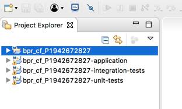

1. From the Eclipse menu select **File -> New -> Project...**  
	

1. Expand the JavaScript branch, select **JavaScript Project** and click **Next**   
	

1. Name the project as *scpsecurity* and click **Finish**   
	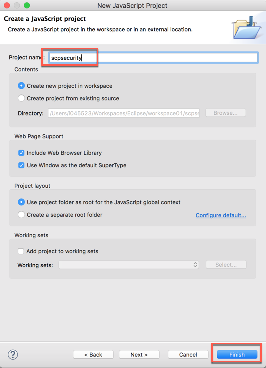

1. Do not open the associated perspective, by answering **No** to this question  
	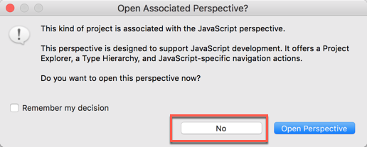

1. Right click on the **scpsecurity** project and choose **New -> Folder**  
	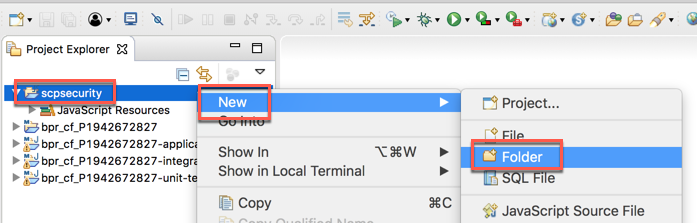

1. Check that your current folder is *scpsecurity* and enter *approuter* as the name of the new folder, then click **Finish**  
	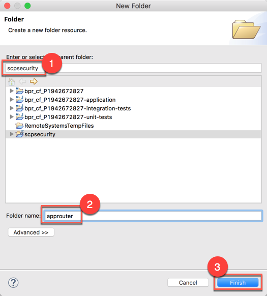

1. Right click on this new *approuter* folder and choose **New -> File**  
	

1. Being sure to be in the proper *scpsecurity/approuter* path, enter *package.json* as the name of the new file and click finish  
	
1. Enter the following content and **save** the file  

	```json
	{
	  "name": "approuter",
	  "dependencies": {
	    "@sap/approuter": "*"
	  },
	  "scripts": {
	    "start": "node node_modules/@sap/approuter/approuter.js"
	  }
	}
	```

	
1. Open a Terminal window, navigate to the folder named *approuter* located in your project; go inside this folder and run the following two commands:  

	```sh
	npm config set @sap:registry https://npm.sap.com
	npm install
	```
	The first command sets the **npm registry** to retrieve all the packages prefixed with "@sap" from the <https://npm.sap.com> web site. Actually, it doesn't matter from where you run this command since this just sets a new parameter in the **npm** configuration. 
	The second command performs the installation of all the required packages (in this case just the *approuter* component, which is taken from the "@sap" repository)  
	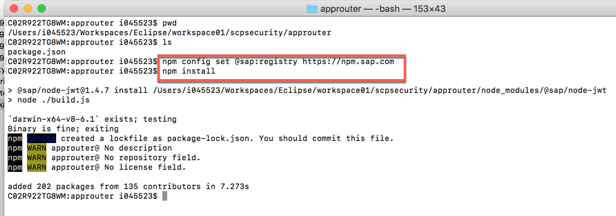

1. When the process finishes, refresh the folder: this is what you should have now in your Eclipse  
	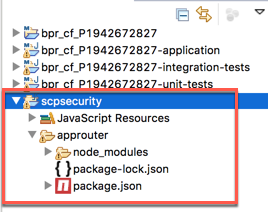

1. Right click on the *approuter* folder and choose **New -> File**    
	  

1. Name the new file as *xs-app.json* and click **Finish**  
	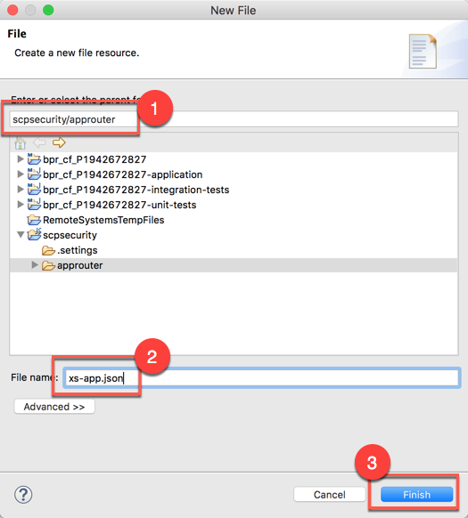  

1. Add this content and save the file  

	```json
	{
	  "welcomeFile": "index.html",
	  "routes": [{
	    "source": "/",
	    "target": "/",
	    "destination": "app-destination"
	  }]
	}
	```
	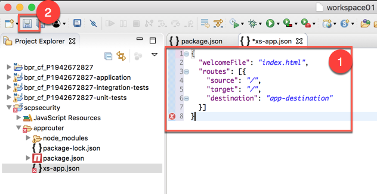

1. Right click on the **scpsecurity** project and choose **New -> File**  
	

1. Create a new file named *manifest.yml* and click on **Finish**  
	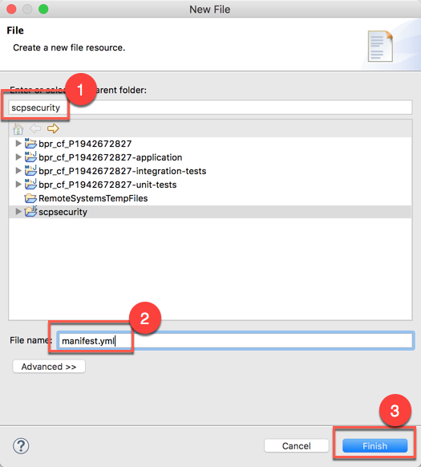

1. Add the following content, making sure to replace the \<tenant\_id\> in the host name with your TenantID (you can get it as the global account name in  the url on the SAP CP cockpit) and replacing the \<application\_link\> variable with the link to the application created in the previous exercise. You need also to make sure that the **TENANT\_HOST\_PATTERN** corresponds to your cloud foundry environment

	```xml
	---
	applications:
	- name: approuter
	  host: approuter-<tenant_id>
	  path: approuter
	  buildpack: nodejs_buildpack
	  disk_quota: 256M
	  memory: 128M
	  env:
	    TENANT_HOST_PATTERN: 'approuter-(.*).cfapps.eu10.hana.ondemand.com'
	    destinations: '[{"name":"app-destination", "url" :"<application_link>", "forwardAuthToken": true}]'
	  services:
	    - bpr_xsuaa
	```  
	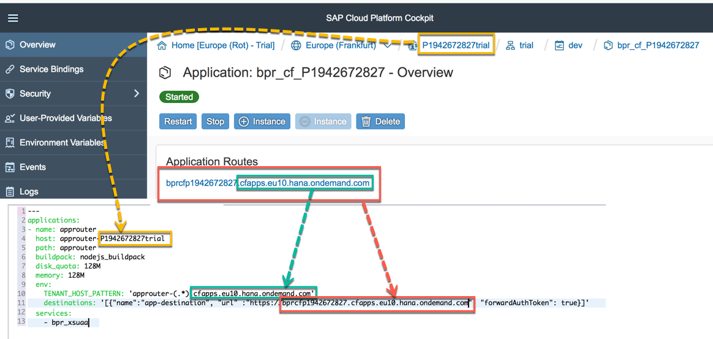

1. Save the file

1. Finally, right click on the **scpsecurity** project again and create one more file  
	

1. Enter the name *xs-security.json* and click on **Finish**  
	

1. Add the following content and before saving, replace the **\<APPLICATION\_NAME\>** variable with the name of your Cloud Foundry application  

	```json
	{
	  "xsappname": "<APPLICATION_NAME>",
	  "tenant-mode": "shared",
	  "scopes": [
	    {
	      "name": "$XSAPPNAME.Display",
	      "description": "display"
	    }
	  ],
	  "role-templates": [
	    {
	      "name": "Viewer",
	      "description": "Required to view things in our solution",
	      "scope-references"     : [
	        "$XSAPPNAME.Display"
	      ]
	    }
	  ]
	}
	```

	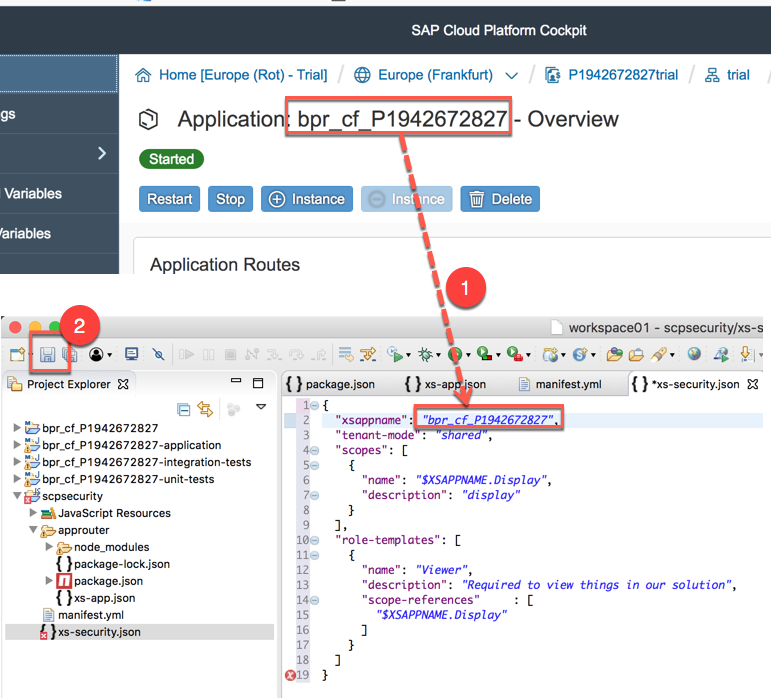

1. We have finished with the **approuter**. We just need to create the **XSUAA** service based on the new *xs-security.json* file. Since we already created this service instance previously, without any particular configuration, we need to unbind this instance from the bound application first, then delete the service and recreate it with some new settings contained in this *xs-security.json* file. All this is done through the following commands in the Terminal window (make sure to be in the *scpsecurity* directory and to replace **\<APPLICATION\_NAME\>** with your application name as in the previous step)  

	```sh
	cf unbind-service <APPLICATION_NAME> bpr_xsuaa
	cf delete-service bpr_xsuaa
	cf create-service xsuaa application bpr_xsuaa -c xs-security.json
	```
	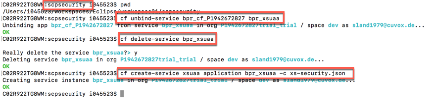

1. Still staying in the *scpsecurity* folder, **push** the *approuter* application to Cloud Foundry. The operation should finish successfully  

	```sh
	cf push
	```
	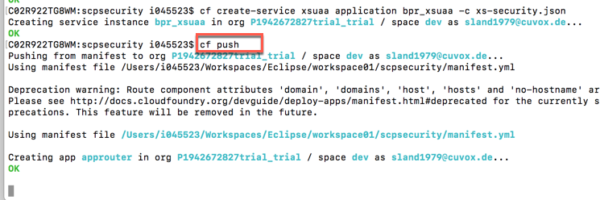

1. Open the browser and enter a URL made by the following parts: **[https://] + [the route you got after pushing to CF] + [/businesspartners]**  
	

1. You will be requested to enter your SAP CP user and password. Enter them and click **Log On**  
	

1. The Approuter brings you directly to the Business Partners page  
	

1. Looking at the SAP Cloud Foundry cockpit you should see now two applications listed in there  
	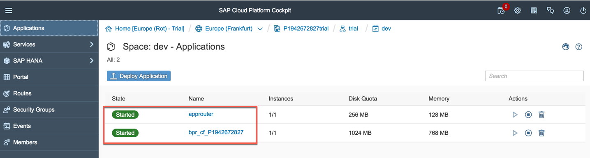

1. You have successfully secured your application with SAP Approuter. Now, in order to access your application you need to pass through the Approuter microservice.


### <a name="spring-security"></a>Securing your application with Spring Security
In this chapter you are going to see how to use Spring Security for securing your application. Now that authentication works with the Approuter, your Java back-end service is still fully visible in the web and not protected. You, therefore, need to protect your Java microservices as well so that they accept requests with valid JWTs for the current user only. In addition, we will setup the microservice in a way that it deals with authorization, i.e., understands the OAuth scopes from the JWT that we have configured previously using the *xs-security.json* file. Here we are going to see how to add Spring security package to you project and in the next chapter how to use it.

1. As a first step, you need to download the XS Security libraries from [here](files/XS_JAVAP_2-70001362.ZIP?raw=true)  

1. Once downloaded the package, extract it in a folder on your disk  
	

1. With the Terminal window go to this folder and run the command

	```
	mvn clean install
	```
	This will add some required XS libraries to your local Maven repository
	

1. You should get the **BUILD SUCCESS** message  
	

1. You have successfully added XS Security libraries to your local Maven repository.


### <a name="strengthen-security"></a>Strengthen security by dealing with authorization
In this chapter you are going to see how to use Spring Security for securing your application. Now that authentication works with the Approuter, your Java back-end service is still fully visible in the web and not protected. You, therefore, need to protect your Java microservices as well so that they accept requests with valid JWTs for the current user only. In addition, we will setup the microservice in a way that it deals with authorization, i.e., understands the OAuth scopes from the JWT that we have configured previously using the xs-security.json file.

1. In Eclipse IDE double click on the *pom.xml* file in the **application** module and switch to the **pom.xml** tab  
	

1. Add the following dependecies in the "**\<dependencies\>**" section and save the file. This dependency section contains three main parts of dependencies:
	- The **org.springframework.security** packages add certain aspects of the Spring security framework to our application, in particular the OAuth framework of Spring security.
	- The **com.sap.xs2.security** packages contain specific security adaptations for the CloudFoundry/XSA environment.
	- The **com.sap.security.nw.sso.linuxx86_64.opt** packages contain platform-specific native implementations for the JWT validation. 

	```xml
		<dependency>
		    <groupId>com.sap.xs2.security</groupId>
		    <artifactId>security-commons</artifactId>
		    </dependency>
		<dependency>
		    <groupId>com.sap.xs2.security</groupId>
		    <artifactId>java-container-security</artifactId>
		    </dependency>
		<dependency>
		  <groupId>com.sap.xs2.security</groupId>
		  <artifactId>java-container-security-api</artifactId>
		  <version>LATEST</version>
		</dependency>
		<dependency>
		  <groupId>org.springframework</groupId>
		  <artifactId>spring-core</artifactId>
		  </dependency>
		<dependency>
		     <groupId>org.springframework</groupId>
		     <artifactId>spring-web</artifactId>
		</dependency>
		<dependency>
		    <groupId>org.springframework.security</groupId>
		    <artifactId>spring-security-jwt</artifactId>
		    <version>LATEST</version>
		</dependency>
		<dependency>
		    <groupId>org.springframework.security.oauth</groupId>
		    <artifactId>spring-security-oauth2</artifactId>
		    <version>LATEST</version>
		</dependency>
		<dependency>
		    <groupId>com.sap.security.nw.sso.linuxx86_64.opt</groupId>
		    <artifactId>sapjwt.linuxx86_64</artifactId>
		    <version>LATEST</version>
		</dependency>
		<dependency>
		    <groupId>com.sap.security.nw.sso.ntamd64.opt</groupId>
		    <artifactId>sapjwt.ntamd64</artifactId>
		    <version>LATEST</version>
		</dependency>
		<dependency>
		    <groupId>com.sap.security.nw.sso.linuxppc64.opt</groupId>
		    <artifactId>sapjwt.linuxppc64</artifactId>
		    <version>LATEST</version>
		</dependency>
		<dependency>
		    <groupId>com.sap.security.nw.sso.darwinintel64.opt</groupId>
		    <artifactId>sapjwt.darwinintel64</artifactId>
		    <version>LATEST</version>
		</dependency>
	```
	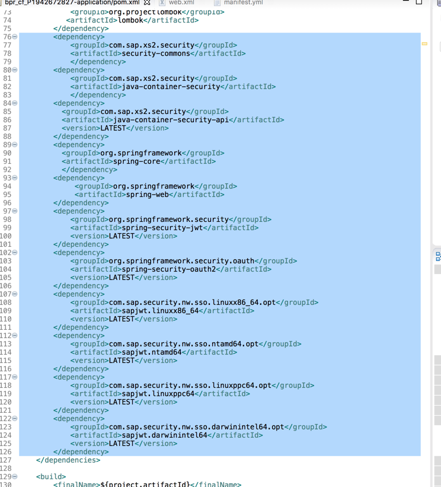

1. Open the *web.xml* file in the *src/main/webapp/WEB-INF* folder. You should see some commented lines  
	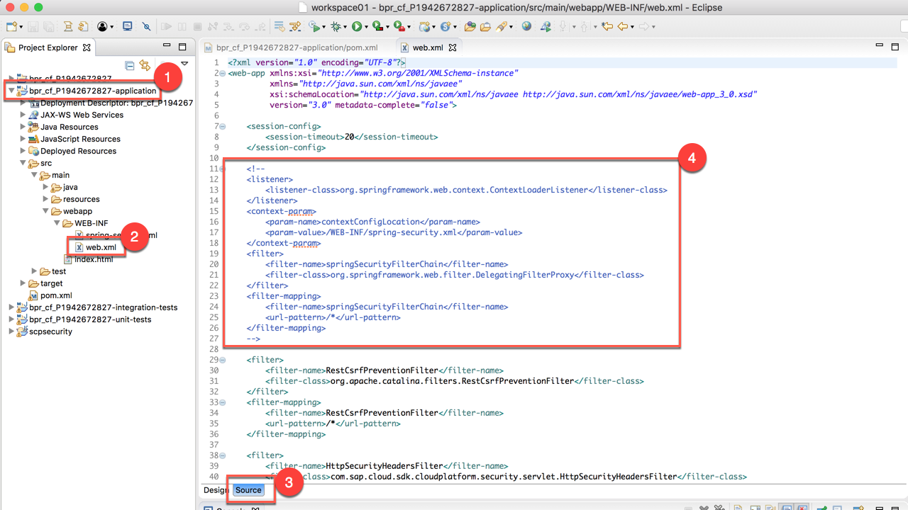

1. Simply uncomment them and save the file. This configuration introduces the Spring Security Filter Chain on all incoming routes of your Java microservice and declares that the entire security configuration can be found in a file called *spring-security.xml*  
	

1. Open the *spring-security.xml* file in the *src/main/webapp/WEB-INF* folder. Verify that this line  

	```xml
	<sec:intercept-url pattern="/**" access="isAuthenticated()" method="GET" />
	```
	is **NOT** commented  
	

1. Open the *manifest.yml* file in the root and add to the list of environment variables the 

	```
	SAP_JWT_TRUST_ACL: '[{"clientid" : "*", "identityzone" : "*"}]'
	```

	this adds to the application the ability to interpret the JWT sufficiently so that the OAuth secret validates the JWT’s signature. Save the file
	  
	

1. Build the project by clicking on the *pom.xml* file in the **application** module and using the Maven build tool  
	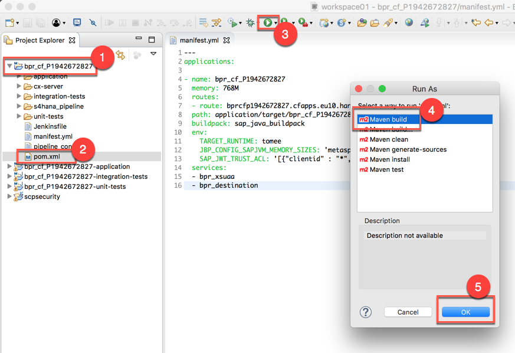

1. Specify again the **clean install** scopes if needed  

1. It should finish successfully  
	

1. Make sure you are in your bpr_cf_<SAP_CP_USER_ID> project folder. Then push the application again  
	

1. After the deployment, close completely your browser

1. Now, reopen the browser and try to access again your application: this should be no longer possible, because you should receive the following error  
	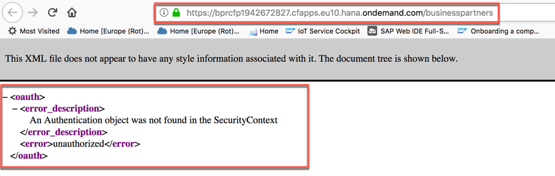

1. However, you should be still able to access your application using the Approuter as the entrypoint. You could be requested again to enter SAP CP credentials  
	

1. If you have previously exposed the backing service directly to the end user, you have used the RestCsrfPreventionFilter on the backend to protect against Cross-Site-Request-Forgery. As this is now in the responsibility of the App Router, you should remove it. For this, comment out or remove the following lines from your *web.xml* and **save** the file

	```xml
	<filter>
	  <filter-name>RestCsrfPreventionFilter</filter-name>
	  <filter-class>org.apache.catalina.filters.RestCsrfPreventionFilter</filter-class>
	</filter>
	<filter-mapping>
	  <filter-name>RestCsrfPreventionFilter</filter-name>
	  <url-pattern>/*</url-pattern>
	</filter-mapping>
	```

	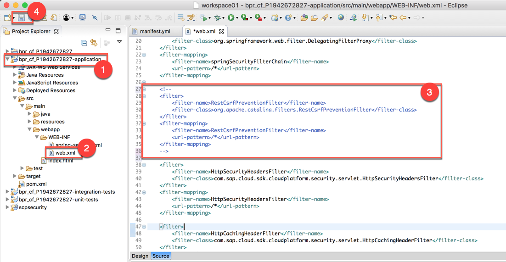

1. You can also unset the variable **ALLOW\_MOCKED\_AUTH\_HEADER** with the command

	```sh
	cf unset-env <APP_NAME> ALLOW_MOCKED_AUTH_HEADER
	```
	because now is up to the Approuter to pass the tenant information to the app
	
1. Rebuild by executing Maven clean and install goals. Push again to Cloud Foundry and the application should be still working fine  
	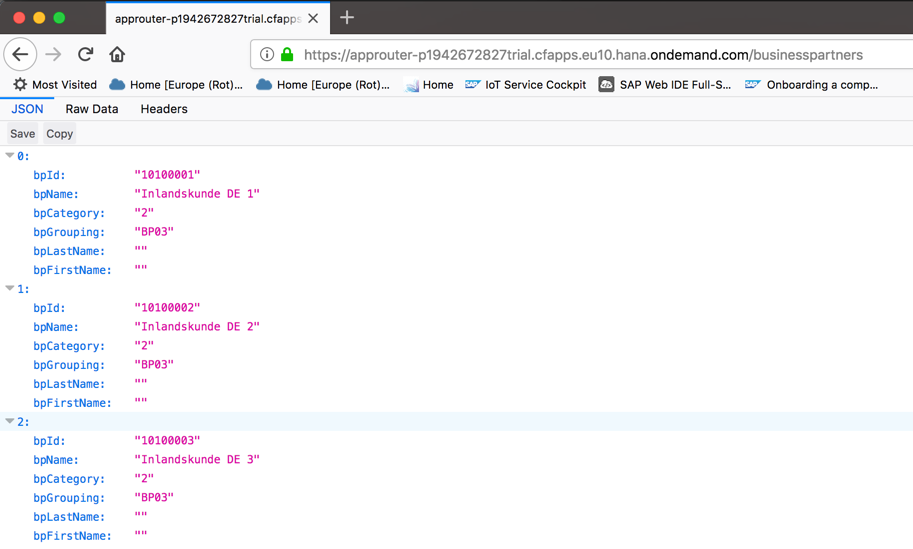

1. You have successfully strengthen security on your application.

	
### <a name="dealing-with-permissions"></a> Dealing with permissions
In this chapter you are going to see how Spring Security can deal with permissions inside SAP CP.

1. Open the *spring-security.xml* file in the *src/main/webapp/WEB-INF* folder. Uncomment the line

	```xml
	<sec:intercept-url pattern="/hello" access="#oauth2.hasScope('${xs.appname}.Display')" method="GET" />
	```
and replace the pattern "/hello" with "/businesspartners". In this case, we protect the **/businesspartners** route with our **Display** OAuth Scope  
	

1. Save the file

1. Rebuild and push again and the application 
	

1. Now, if you try to access the application's endpoint **/businesspartners**, you will get an "Access denied" error, because we have protected this endpoint with some roles  
	

1. To overcome this open the SAP CP cockpit and navigate to your Cloud Foundry space. Expand the **Security** branch and choose **Role Collections**. Click on **New Role Collection**  
	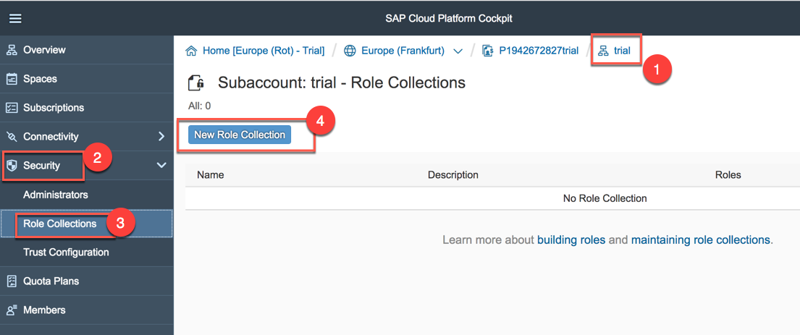

1. Enter the name **BPManager** and the description **Business Partners Manager** and click on **Save**  
	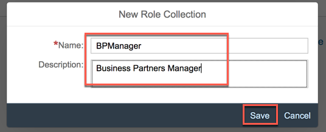

1. You should have a new role collection in the list. Click on this new role collection  
	

1. Click **Add Role**  
	

1. Select the proper **Application Identifier** (the one which starts with "bpr_cf") and choose for both **Role Template** and **Role** the item **Viewer**, then click **Save**  
	

1. A new role has been successfully added  
	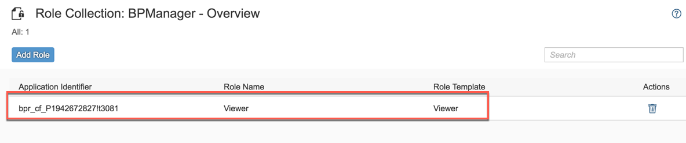

1. First click on your **space** in the navigation bar, then select **Trust Configuration** and click on the **SAP ID Service**  
	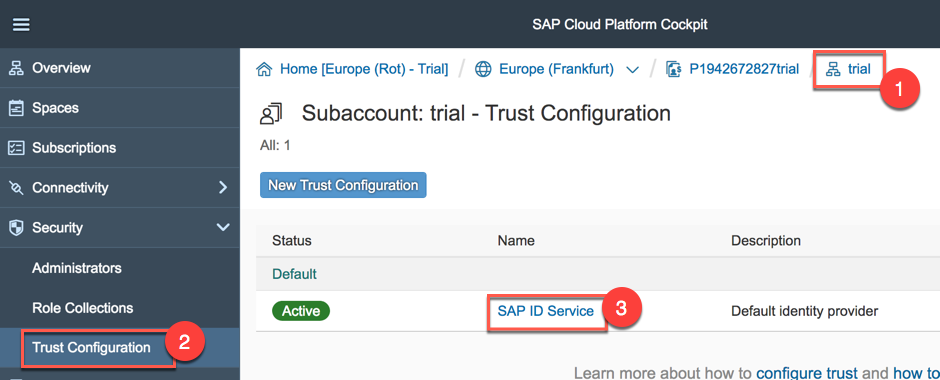

1. Enter your user email for the SAP CP and click **Show Assignments**  
	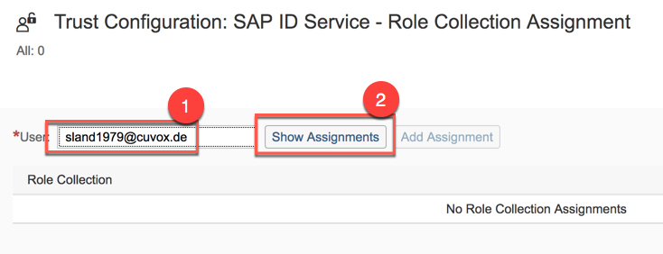

1. Click **Add Assignment**  
	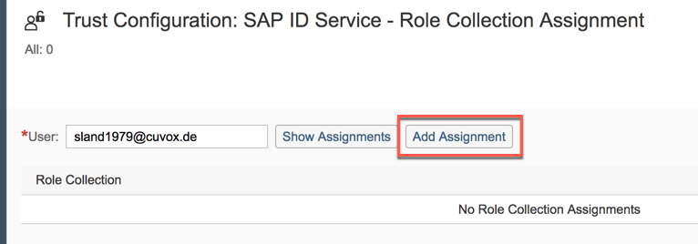

1. Select the **BPManager** role rollection and click on **Add Assignment**   
	

1. A new role collection assignment has been made for your user  
	

1. Completely close your browser since you need to relogin  
	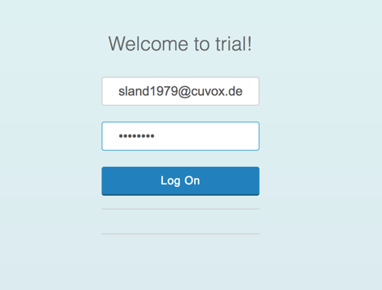

1. Now your "**/businesspartners**" endpoint is working fine again!   
	

1. Congratulations! You have successfully enhanced your Cloud Foundry application.

## Summary
This concludes the exercise. You should have learned how to introduce authentication into your application using the SAP Approuter component, how to protect your Java microservice so that it only accepts requests based on a valid JSON Web Token (JWT) and how to assign roles and scopes to users. Please proceed with the next exercise.
