<table width=100% border=>
<tr><td colspan=2><h1>EXERCISE 3_1 - MULTI-TENANT APPLICATIONS</h1></td></tr>
<tr><td><h3>SAP Partner Workshop</h3></td><td><h1> &nbsp;60 min</h1></td></tr>
</table>


## Description
In this exercise, you’ll learn how connectivity service resolves destination visibility for extension apps, how to protect multitenancy application by roles, how it works during multitenancy scenario and how to use tenant aware API’s during development of multitenant application.  

The output of the application displays a welcome page showing the URI of the tenant-specific details, destination configuration and user details. It also shows, how users of the consumer subaccount, which is subscribed to this application, can access the application using a tenant-specific URL and how manage role and identity management with regard to consumer subaccount.

> NOTE: - Idea of this hands-on exercise is to illustrate the concept which can be applied when developing SuccessFactors extension application. As we are not leveraging roles, users from SuccessFactors instance for this hands-on exercise for the sake of simplicity.

* Set up of Eclipse with SAP Cloud Platform plugins 
* SAP Cloud Platform Extension account access

Refer to this blog to deep dive into multitenancy application development  
<https://blogs.sap.com/2016/11/09/developing-multi-tenant-applications-on-the-sap-hana-cloud-platform/>


## Target group

* Developers
* People interested in learning about S/4HANA extension and SDK  


## Goal

The goal of this exercise is to unerstand how to use tenant and user API connectivity service with Multi-Tenant Applications.  

## Prerequisites
  
Here below are prerequisites for this exercise.

* SAP Cloud Platform account
* Java / Eclipse IDE


## Steps

1. [Overview](#overview)
1. [Create sample servlet](#create-sample-servlet)
1. [Test the application on your local Tomcat web server](#test-locally)
1. [Let’s deploy application to SAP Cloud Platform](#deploy-to-sap-cp)
1. [Let’s subscribe to sample java apps from the provider account](#subscribe-to-java-apps)


### <a name="overview"></a>Overview
Multitenant applications that require connection to a remote service can use the connectivity service to configure HTTP or RFC endpoints. In a provider-managed application, such an endpoint can either be once defined by the application provider or by each application consumer. If the application needs to use the same endpoint, independently from the current application consumer, the destination that contains the endpoint configuration is uploaded by the application provider. If the endpoint should be different for each application consumer, the destination shall be uploaded by each application consumer.
Destinations can be simultaneously configured on three levels: 

- application
- consumer subaccount
- subscription

This means it is possible to have one and the same destination on more than one configuration level. 
Destinations visibility according to the level is

- **destination uploaded on consumer subaccount level** - it is visible for the whole subaccount
- **destination uploaded on consumer subscription level** - it is only visible for the dedicated subscription
- **destination uploaded on provider application level** - it is visible by all tenants and subaccounts, regardless their permission settings.

<u>When the application accesses the destination at runtime, the connectivity service tries to first lookup the requested destination in the consumer subaccount on subscription level. If no destination is available there, it checks if the destination is available on the subaccount level of the consumer subaccount. If there is still no destination found, the connectivity service searches on application level of the provider subaccount.</u>
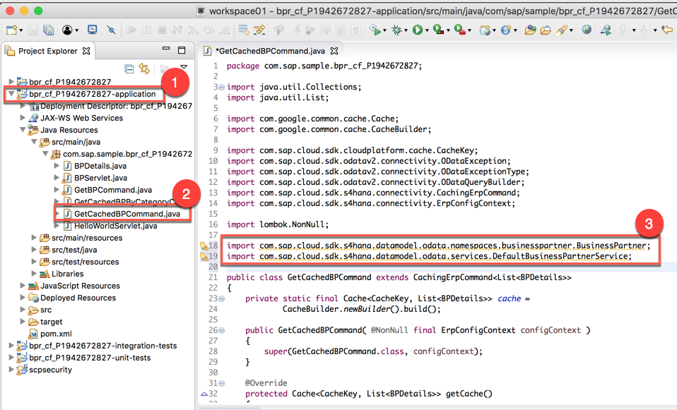


### <a name="create-sample-servlet"></a>Create sample servlet
Let’s first create sample servlet application to test connectivity service functionality.

1. Open your Eclipse IDE and switch to the **Java EE** perspective  
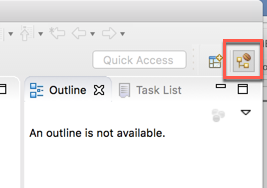
1.	Download the [multitenant.zip](files/multitenant.zip) file and extract it into a folder on your workstation
1.	Go to **File->Import->Maven->Existing Maven Project** and click on **Next**  

1.	Browse for the path to the folder where you extracted the *multitenant.zip* file, check that the *pom.xml* file is selected and click on **Finish**. Maven project is getting imported into local workspace  
	
1. Right click on the project name and choose **Refactor->Rename**. Since all the attendees to this workshop will be deploying applications to a shared SAP Cloud Platform account, they need to have different application names  
	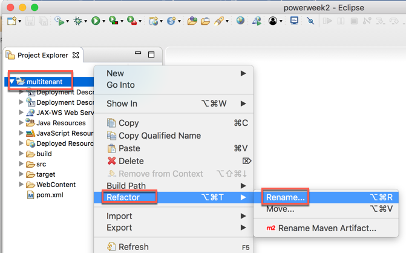
	> NOTE: Refactor renames the selected element and (if enabled) corrects all references to the elements (also in other files).

1. Give a project unique name like **multitenant\<XX\>**, where **\<XX\>** is the **workstation ID** assigned by your instructor  
	
1. If you see errors after refactoring, right click on the project and choose **Maven->Update Project**  
	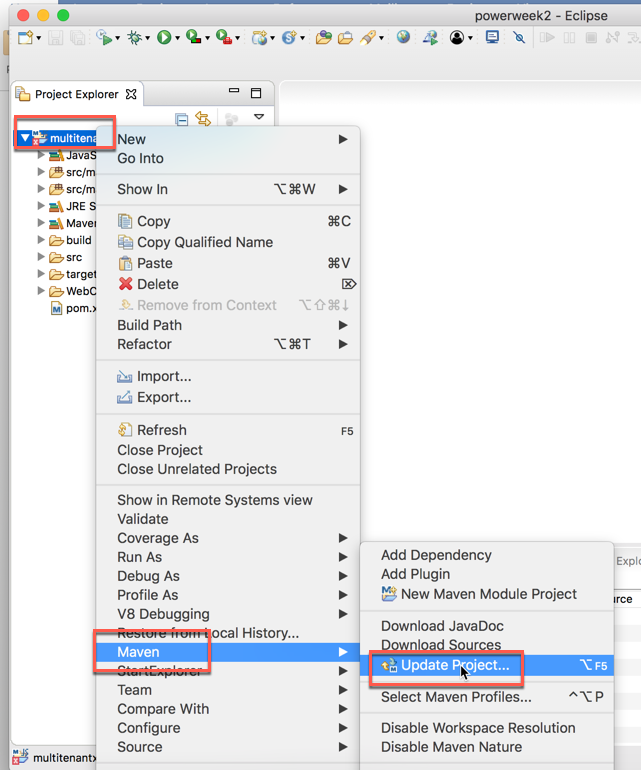
1.	Click on **OK**  
	
1.	Right click again on the project and select **Run As->Maven Build**  
	
1.	Edit the **Goals** by entering `clean install` and click **Run**  
	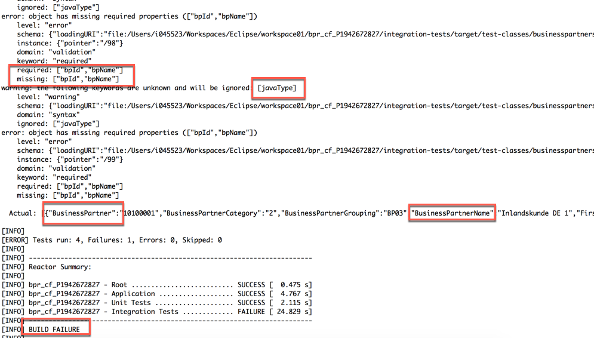
	> NOTE: This command tells Maven to build all the modules and to create a *target* folder where the built ones are copied.

1.	Check that you got BUILD SUCCESS status in the Console view  	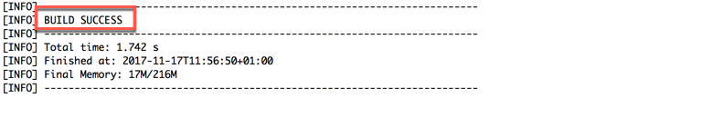


### <a name="test-locally"></a>Test the application on your local Tomcat web server
The application has been built: you can just test it on your local Tomcat web server. In this step, we will be enhancing previously created sample extension app to add more logic to invoke tenant context API’s, user API, protect apps by role and finally test connectivity service.
  
Look at *web.xml* file (*WebContent->WEB-INF->web.xml*): we added a few JNDI look up resources for tenant context API, Authentication, authorization roles and “search_engine_destination” destination for connectivity service look-up.

> NOTE: JNDI stands for Java Naming and Directory Interface, which is an application programming interface (API) that provides naming and directory 
functionality to applications written using the Java programming language

```xml
<?xml version="1.0" encoding="UTF-8"?>
<web-app xmlns="http://xmlns.jcp.org/xml/ns/javaee" xmlns:xsi="http://www.w3.org/2001/XMLSchema-instance"
	xsi:schemaLocation="http://xmlns.jcp.org/xml/ns/javaee
		 http://xmlns.jcp.org/xml/ns/javaee/web-app_3_1.xsd"
	version="3.1">
	<display-name>multitenant</display-name>
	<welcome-file-list>
		<welcome-file>Connect</welcome-file>
	</welcome-file-list>

	<!-- Declare the JNDI lookup of Tentant -->
	<resource-ref>
		<res-ref-name>TenantContext</res-ref-name>
		<res-type>com.sap.cloud.account.TenantContext</res-type>
	</resource-ref>
	<!-- Declare the JNDI lookup of destination -->
	<resource-ref>
		<res-ref-name>search_engine_destination</res-ref-name>
		<res-type>com.sap.core.connectivity.api.http.HttpDestination</res-type>
	</resource-ref>
	<resource-ref>
		<res-ref-name>connectivityConfiguration</res-ref-name>
		<res-type>com.sap.core.connectivity.api.configuration.ConnectivityConfiguration</res-type>
	</resource-ref>
	<!-- Declare the JNDI lookup of UserProvider -->
	<resource-ref>
		<res-ref-name>user/Provider</res-ref-name>
		<res-type>com.sap.security.um.user.UserProvider</res-type>
	</resource-ref>

	<login-config>
		<auth-method>FORM</auth-method>
	</login-config>
	<security-constraint>
		<web-resource-collection>
			<web-resource-name>Protected Area</web-resource-name>
			<url-pattern>/Connect</url-pattern>
		</web-resource-collection>
		<auth-constraint>
			<role-name>Admin</role-name>
		</auth-constraint>
	</security-constraint>
	<security-role>
		<description>All SAP Cloud Platform users</description>
		<role-name>Admin</role-name>
	</security-role>
</web-app>
```

Before we deploy and test the latest changes on local Tomcat 8 server in Eclipse, we need to create a user ID, roles and other user attributes to test the latest changes.
> NOTE: This process is for testing purposes only. When you deploy to the cloud, user authentication is still handled by the IDP configured with the extension account. Once you have added user authentication/authorization to your Java application, you can test it first on the local server before uploading it to SAP Cloud Platform.

Look here to get more information: <https://help.sap.com/viewer/65de2977205c403bbc107264b8eccf4b/Cloud/en-US/fe47e02fd9514ab889c37250ed771c0c.html>


1.	Open **Servers** view from **Windows->Show View->Servers**  
	
1.	Click on the link in the pane or right click on the white space to create a **new server**  
	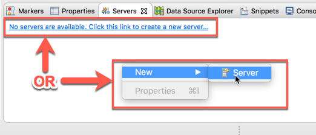
1.	From the **SAP** container choose **Java Web Tomcat 8 Server**, keep **localhost** as server's host name and click on **Next**  
	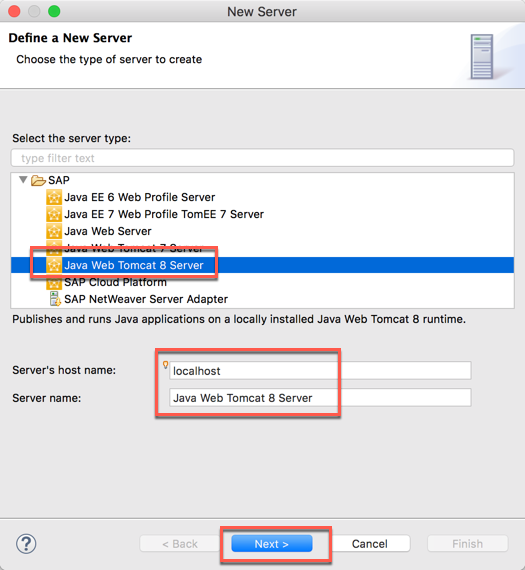

1. Browse for the latest version of Java Web Tomcat 8 SDK you have installed according to the prerequisites, keep the **Workbench default JRE** and click on **Finish**  
	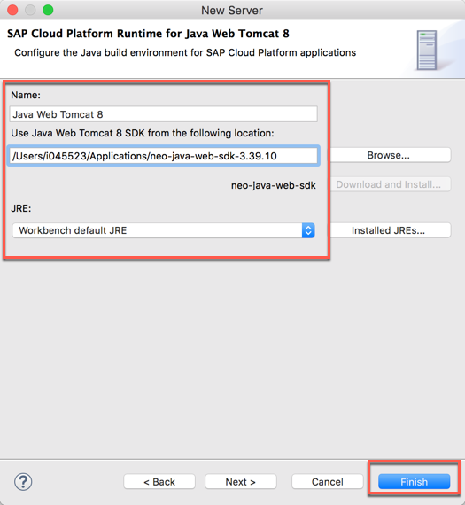
1. Click on **Allow** in case you get this message  
	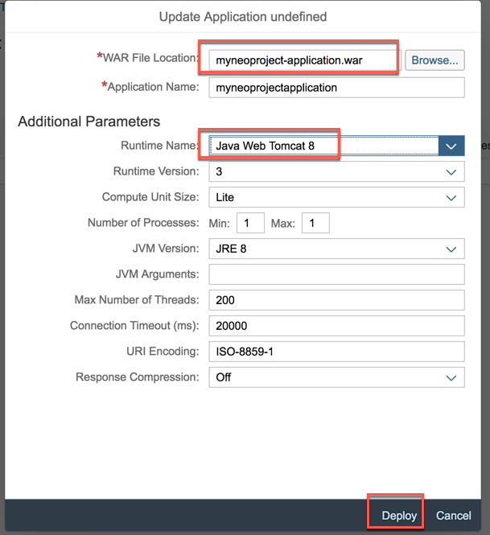
1. The server is created: at moment it's empty and stopped  
	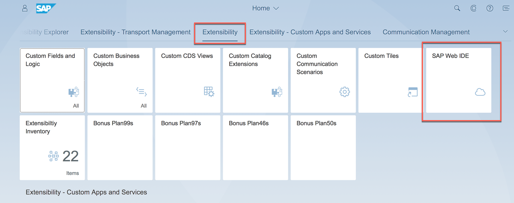
1.	Double click on the **Java Web Tomcat 8 Server** in the Server pane, switch to **Users** tab and click on the "**+**" sign to add a new user  
	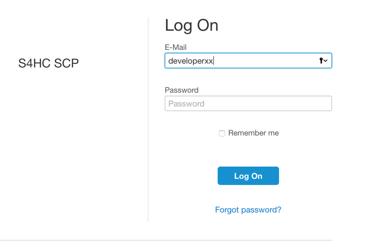
1. Enter "**testuser**" as User ID, choose a password for this user and click **OK**  
	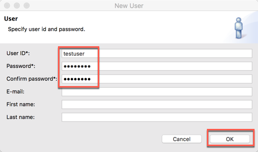
1. The user is created: now, let's add a new role. Click on the "**+**" sign in the **Roles** section  
	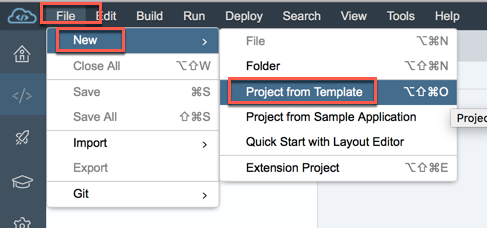
1. Enter "**Admin**" and click on **OK**  
	
1. Now the **testuser** has this **Admin** role assigned  
	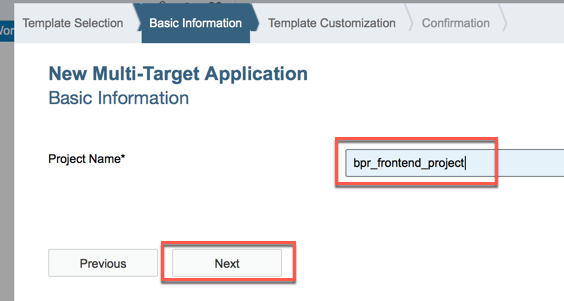
1. Download the file [search\_engine\_destination.txt](files/search_engine_destination.txt?raw=true) by right clicking on this link and choosing **Save link as...**  
1. Click on the **Connectivity** tab and choose **Import existing Destination**  
	
1. Select the file you have just downloaded  
	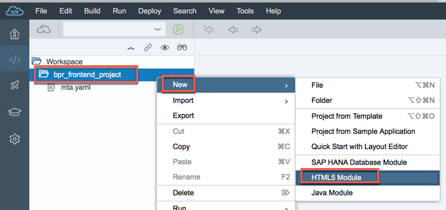
1. The destination is imported: save the configuration file by clicking on the disk icon on the top left corner  
	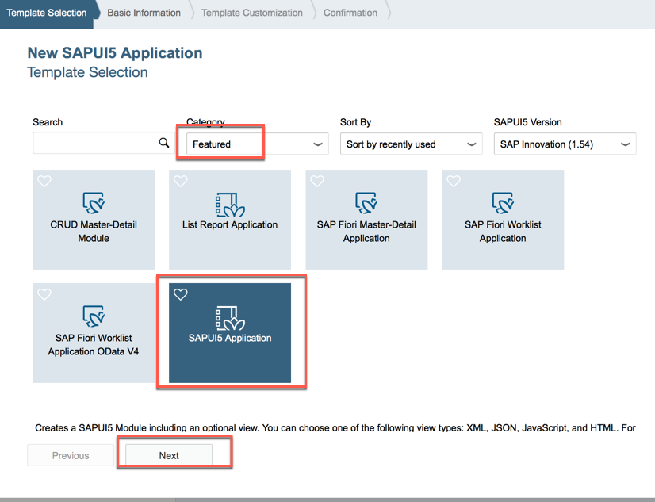
1. Now you can run the application: right click on the project and select **Run As->Run on Server**  
	
1. Choose an existing server and select the **Java Web Tomcat 8 Server**. Then click on **Finish**  
	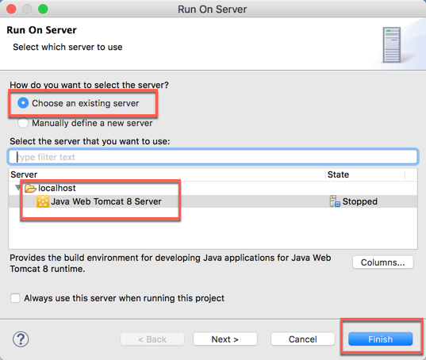
1. After a while the server will be **Started** and **Synchronized**  
	
1. Right click on the name of the server in the Server pane and choose **Application URL->Open**  
	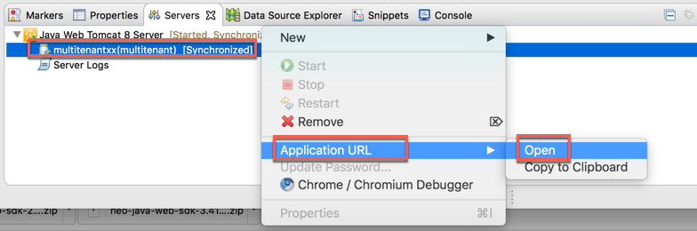
1. The logon page will be opened in the Eclipse browser. Enter the credentials for the "testuser" you previously defined and click on **Log in**  
	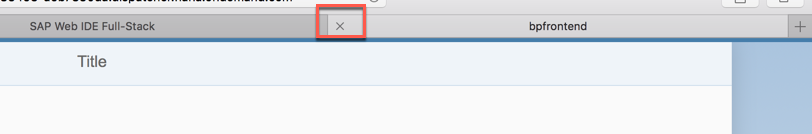
1. The application should show some information about its configuration. Of course, since you are testing it on local, you don't have any tenant detail  
	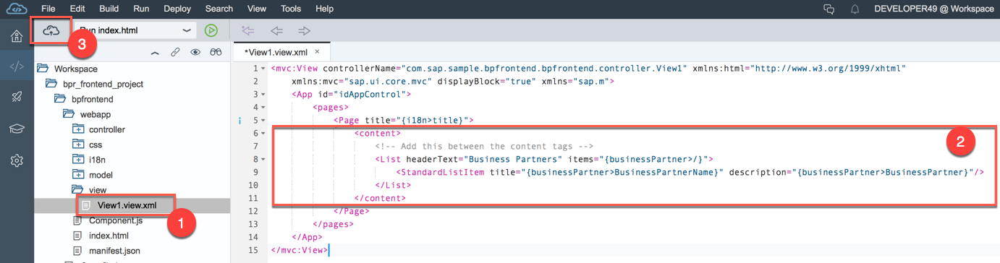
1. Congratulations! You have successfully tested your Java application locally.


### <a name="deploy-to-sap-cp"></a>Let’s deploy application to SAP Cloud Platform
In this step, we will be deploying the application we have tested locally in the previous step, to SAP Cloud platform provider account. For this hands-on exercise, we have set up two sub-accounts: one will act as provider account (PROD) and the other (CONSUMER) as consumer account.   
  
You will be deploying multitenancy application to provider account and subscribing to it from the consumer account.

1.	Add a new server by right clicking on the white space inside the Servers pane  
	
1. Choose **SAP Cloud Platform** from the SAP catalog and fill

	Parameter  |Value
	-----------|---------------------------------------
	Region host|hana.ondemand.com
	Server name|SAP Cloud Platform at hana.ondemand.com

	Click on **Next**  
	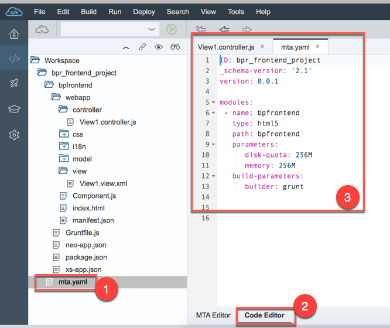
1. Enter the following values and click on **Next**:

	Parameter  |Value
	----------------|---------------------------------------
	Application name|connectivity\<xx\> (replace  **\<xx\>** with **your workstation id**
	Runtime         |Java Web Tomcat 8
	Subaccount name |ab796571d
	User name       |\<your\_P/S-username\>
	Password        |\<your\_password\>
	Save password   |not flagged

	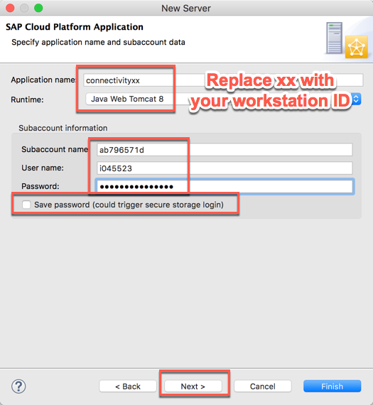
1. Select the *multitenant* application and click on **Add** to publish this application on the server. Then click **Finish**  
	
1. When the process finishes, your application has been pushed to the SAP Cloud Platform, but at moment is still stopped  
	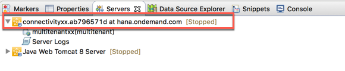
1. Go to your SAP Cloud Platform cockpit and, among **Java Appplications**, click on the application's name you just pushed  
	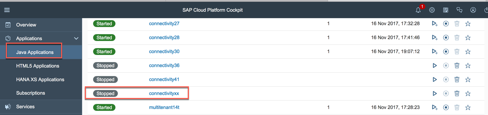
1. The screen shows you some important details about the chosen application. Click on the **Destinations** tab  
	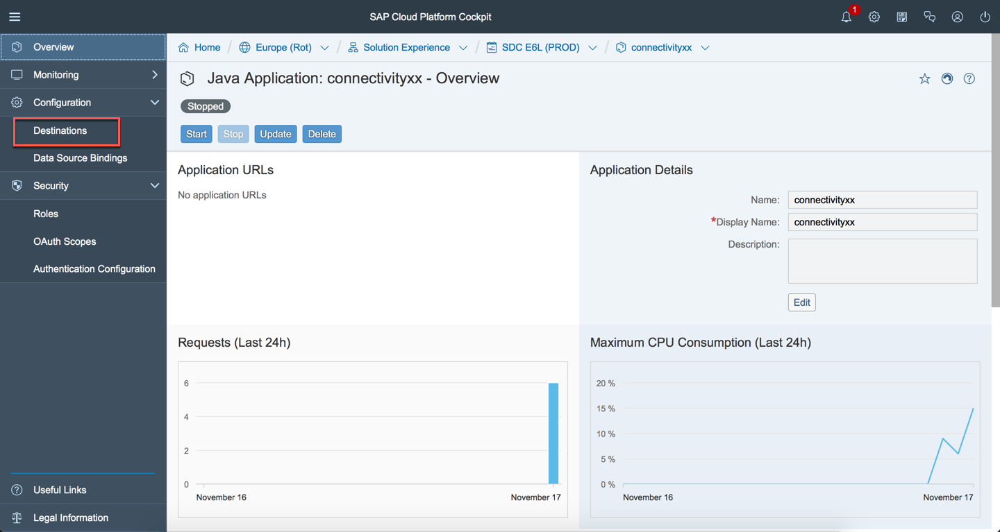
1. In the **Destinations** tab, click on **Import Destination**  
	
1. Browse for the *search\_engine\_destination.txt* file you already downloaded  
	
1. The destination is imported. Keep it as it is and click on **Save**  
	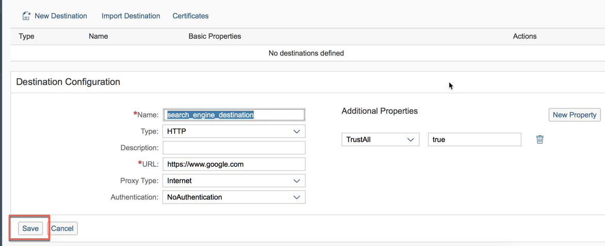
1. Click on the **Roles** tab under Security on the left side and then click on **New Role**  
	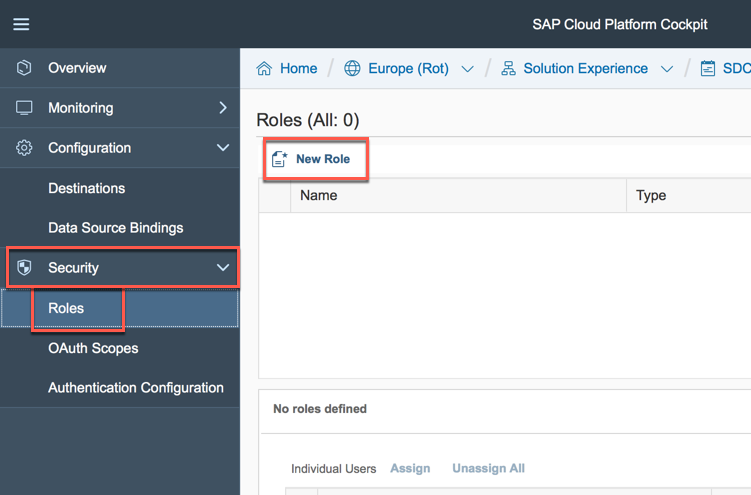
1. Add the **Admin** role and click on **Save**  
	
1. The role has been added: now click on the **Assign** button  
	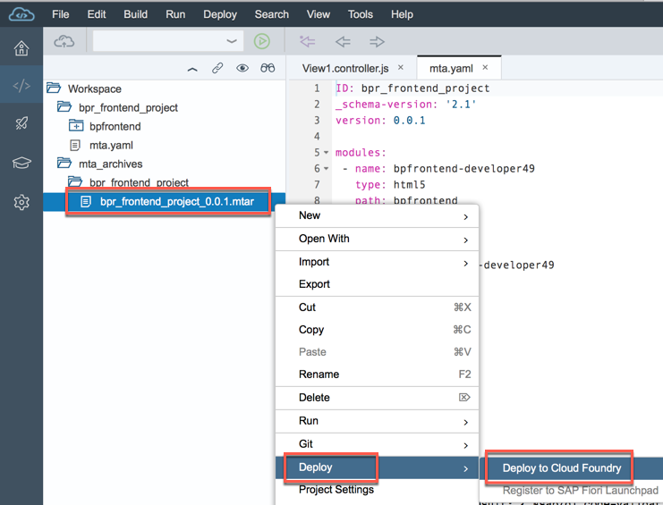
1. Enter your user for this role and click on **Assign**  
	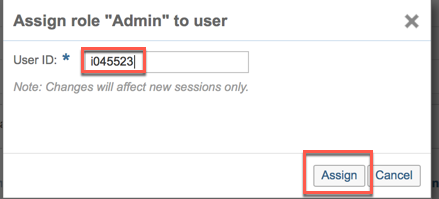
1. Security is properly configured: click on the **Overview** tab to go back to the application details  
	
1. Go back to Eclipse and start the application by selecting the *connectivity* server and clicking on the "play" button on the pane's toolbar  
	
1. After a couple of minutes the application starts  
	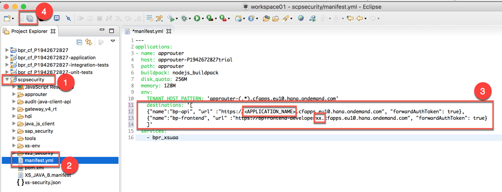
1. Going back to your SAP Cloud Platform cockpit you see that even here, in the **Overview** page, the application is reported as started. In the same page there is also the **application URL**. Click on this link  
	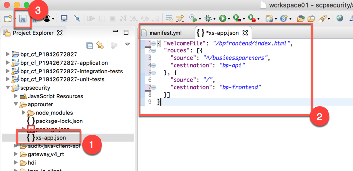
1. The application's home page is shown: here you can find many more details about the tenant where the application is running  
	
1. Congratulations! You have successfully deployed you Java application to the SAP Cloud Platform using Eclipse IDE.


### <a name="subscribe-to-java-apps"></a>Let’s subscribe to sample java apps from the provider account
To demonstrate multitenancy concept, we are going to make the consumer account adfd16960 to subscribe to the application "connectivity" in the provider account ab796571d.

1. First of all, check the path where you have installed the SAP Cloud Platform Tools: let's assume it's **\<path\_to\_neo\>**
1. Open Terminal and run the following command 
	
	```sh
	<path_to_neo>/tools/neo subscribe -a <subaccount_name> -b <your_app> -h hana.ondemand.com -u <YOUR_SAP_USER>
	```
	
	which, in your case, should become

	#### MAC	

	```sh
	<path_to_neo>/tools/neo.sh subscribe -a adfd16960 -b ab796571d:connectivity<xx> -u <your_user> -h hana.ondemand.com
	```

	#### WINDOWS
	```sh
	<path_to_neo>\tools\neo.bat subscribe -a adfd16960 -b ab796571d:connectivity<xx> -u <your_user> -h hana.ondemand.com
	```
	
	where you need to replace **\<xx\>** with your **workstation ID** and **\<your_user\>** with you P/S-user on SAP Cloud Platform  
	
> NOTE: in case you get the message to confirm that you are located inside the EU, simply click on YES.
1. Looking in the SAP Cloud Platform cockpit, under the **Subscriptions** tab, you can see that switching on the toolbar to the **CONSUMER** account, a new subscription has been added in the Subscribed Java Applications set. Click on the subscribed application (connectivity\<xx\>)  
	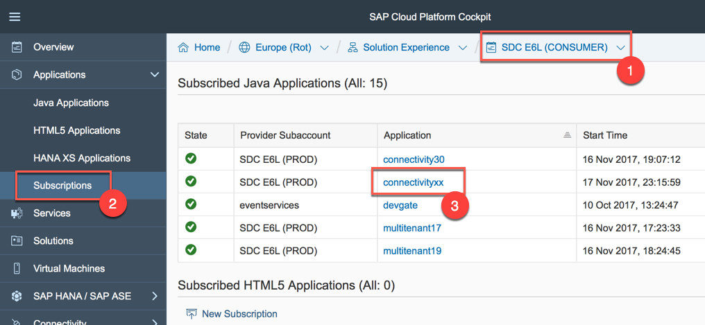
1. The subscription details are shown in the **Overview** tab. If you try to execute the application by clicking on the subscription link...  
	
1. ... you will see that the application fails with a "**Forbidden**" message. This because we have not yet set up permissions for this subscription  
	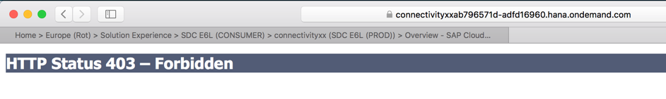
1. Go to **Roles** tab. The roles is already in because it's inherited from the provider account, but we need to assign users to it. Click on the **Assign** button  
	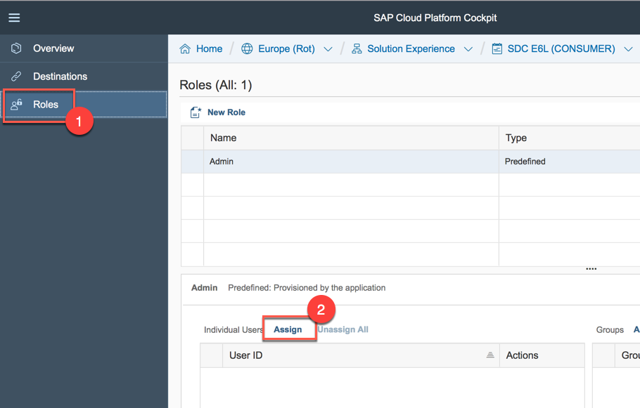
1. Enter your P/S-user and click on **Assign**  
	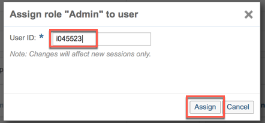
1. This is how the overview page should appear  
	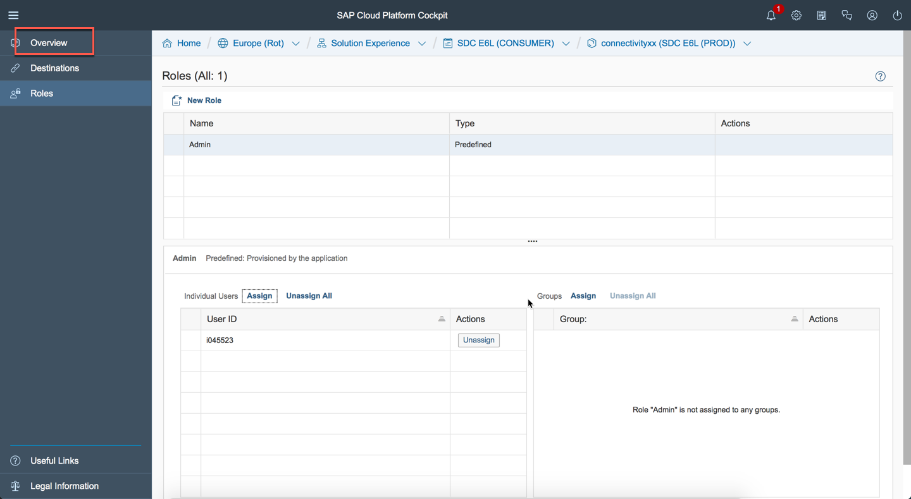
	> NOTE: you might need to refresh or close and reopen your browser to get the updated status. 
1. Now click on the subscription link in the overview page  
	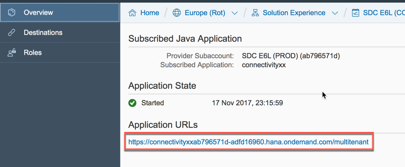
1. You should get the application page. Look at the destination information: the application is using the destination registered in the CONSUMER account, this because there is no destination in the SUBSCRIBED application  
	
1. Go to the **Destinations** tab in the CONSUMER account subscription and click on **Import Destination**  
	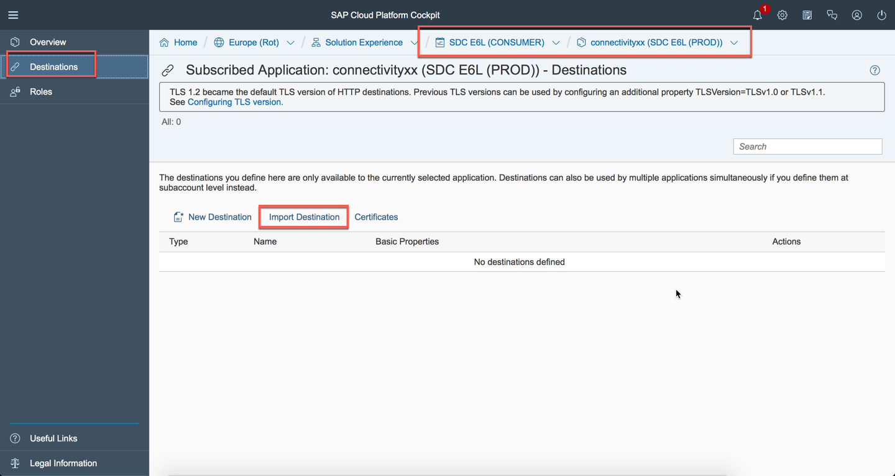
1. Import again the *search\_engine\_destination.txt* provided with this exercise, change the search URL to <https://www.bing.com> and click on **Save**  
	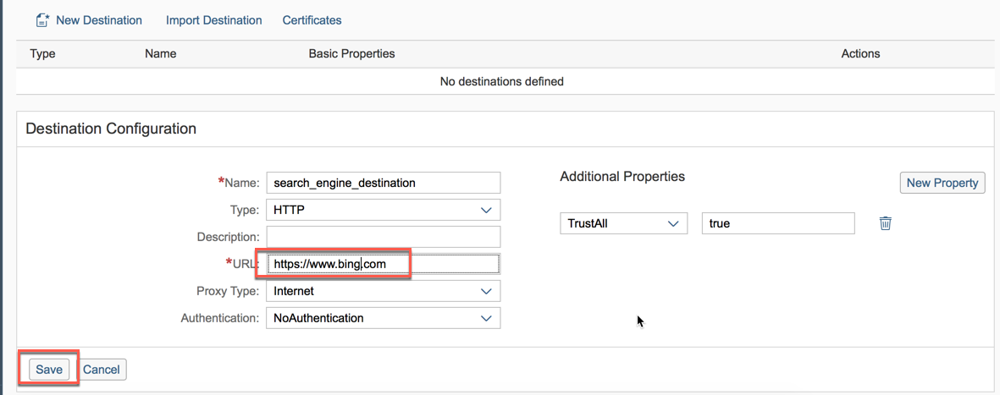
1. Refresh your browser (you might need to wait up to 5 minutes in order to get the change) and you will see that now the application is taking the new destination  
	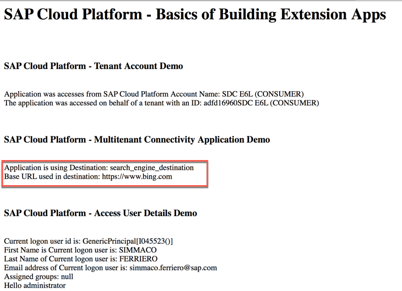
1. Congratulations! You have finished the exercise!

## Summary
This concludes the exercise. You should have learned how to deal with multi-tenant applications.
