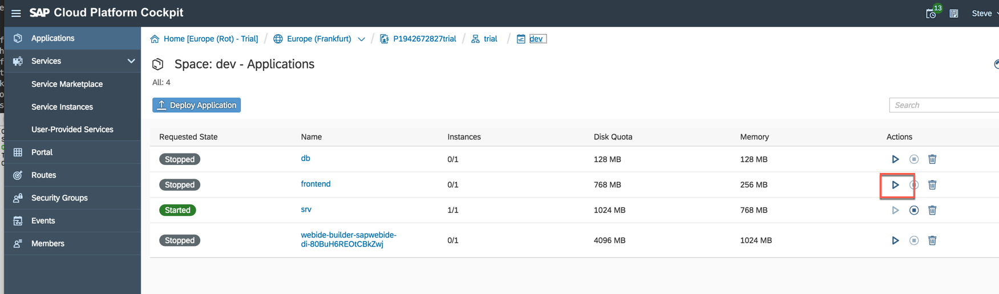
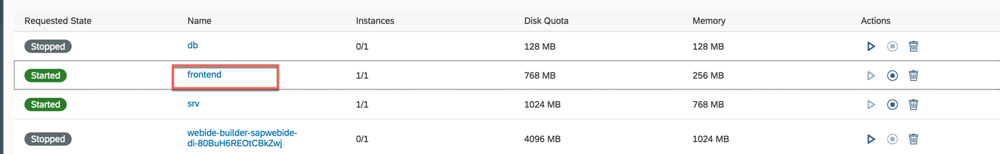
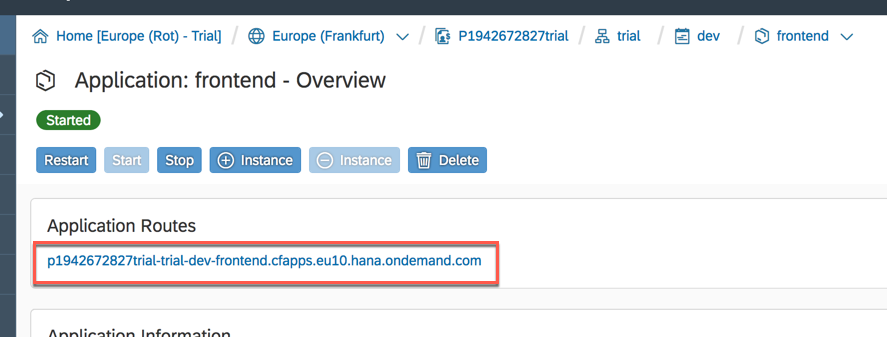
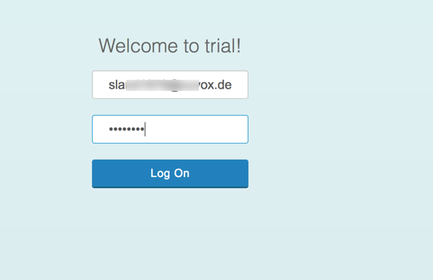
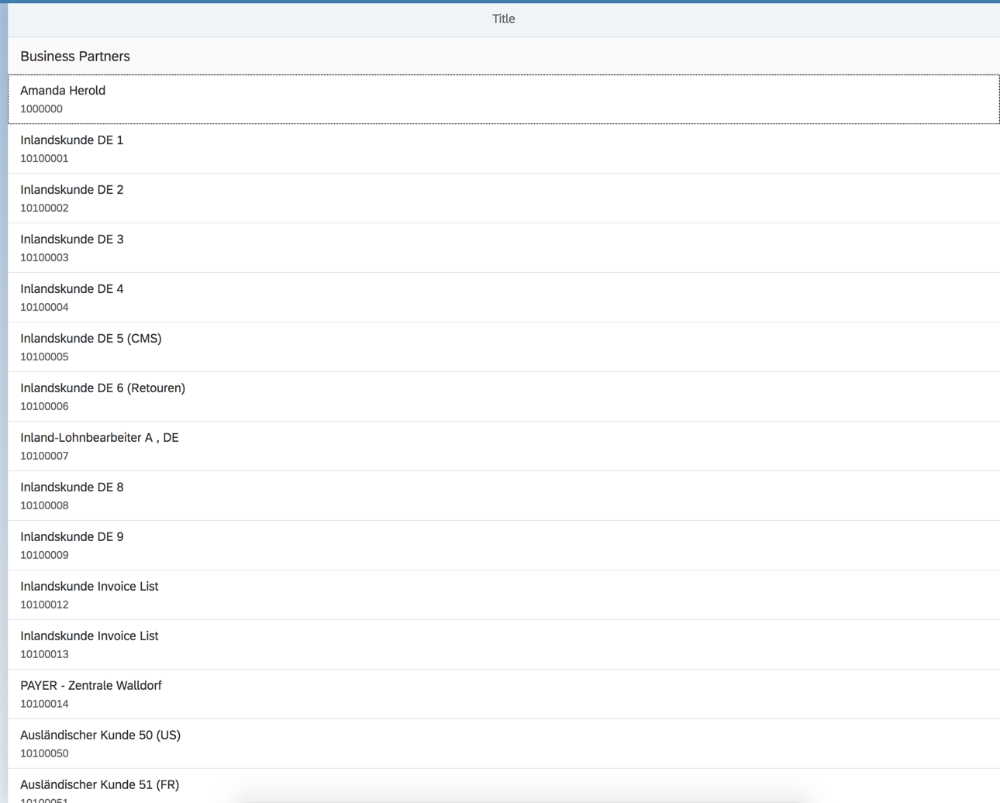

<table width=100% border=>
<tr><td colspan=2><h1>EXERCISE 2_2 - DEVELOP A FRONT-END APPLICATION USING APPLICATION PROGRAMMING MODEL</h1></td></tr>
<tr><td><h3>SAP Partner Workshop</h3></td><td><h1> &nbsp;60 min</h1></td></tr>
</table>


## Description
In this exercise, you’ll learn how to 

* create a new application using the Business Application Programming Model template
* create a service and a frontend application with SAP Web IDE Full-Stack.


For further reading on SAP S/4HANA Cloud SDK, click link below.
<https://www.sap.com/germany/developer/topics/s4hana-cloud-sdk.html>


## Target group

* Developers
* People interested in learning about S/4HANA extension and SDK  


## Goal

The goal of this exercise is to create a frontend application for your service using the Business Application Programming Model template in SAP Web IDE Full-Stack.  

## Prerequisites
  
Here below are prerequisites for this exercise.

* A trial account on the SAP Cloud Platform. You can get one by registering [here](https://account.hanatrial.ondemand.com)
* Java JDK 8
* Cloud Foundry CLI [download it here](https://github.com/cloudfoundry/cli)
* The source code created in the previous exercise
* A S/4HANA system with a working communication arrangement for the Business Partners collection


## Steps

1. [Create a new application with the Business Programming Model template](#new-application)
1. [Use previous code in Business Programming Model application](#use-code)
1. [Build the project](#build-project)
1. [Deploy the project](#deploy-project)
1. [Add the frontend module](#frontend-module)
1. [Build and deploy to backend system with some final adjustments](#build-deploy)


### <a name="new-application"></a>Create a new application with the Business Programming Model template

In this chapter you are going to see how to use SAP Web IDE to create a new application with the Business Application Programming Model. 

1. Login to the Trial Landscape <https://account.hanatrial.ondemand.com/cockpit> with your credentials  
	

1. Go to your Cloud Foundry space and delete all the existing applications  
	

1. Duplicate the current tab in your browser  
	

1. Within the new tab, click on the first breadcrumbs link you see on the top of your screen: it's your home  
	

1. Click on the **Neo Trial** tile to access your Neo landscape  
	

1. Click on **Services** on the left hand side, search for "web" and click on the **SAP Web IDE Full-Stack** tile  
	

1. Click on **Go to Service** to open SAP Web IDE Full-Stack  
	

1. You should get this screen when you clikc on the Develpment tab on left hand side  
	

1. From the main menu, select **File -> New -> Project from Template**  
	

1. Under the **Featured** category select the **SAP Cloud Platform Business Application** template and click **Next**  
	

1. Enter a project name (i.e. "bpr_bam") and click **Next**  
	

1. Keep other fields as proposed, just change the package to "com.sap.sample.bpr_bam" and click **Finish**  
	

1. In the Workspace now you can see your new project  
	


### <a name="use-code"></a>Use previous code in Business Programming Model application

1. First of all, double click on the *pom.xml* file under the *bpr_bam/srv* folder and, just after the "properties" tag, add the following **dependencies**. Then save the file. Here we are adding some required dependencies for the Java service that we are going to create

	```xml
	<dependencies>
        <dependency>
            <groupId>javax.servlet</groupId>
            <artifactId>javax.servlet-api</artifactId>
            <scope>provided</scope>
        </dependency>

		<dependency>
			<groupId>org.projectlombok</groupId>
   			<artifactId>lombok</artifactId>
   			<version>LATEST</version>
		</dependency>
	</dependencies>
	```
	

1. Now, expand the *bpr_bam/srv/src/main/java/com/sap/sample/bpr_bam* folder, right click on the *bpr_bam* leaf and choose **New -> Java Class** to create a new Java class in this folder  
	

1. Name this class as *GetCachedBPCommand* and click **Next**  
	

1. Click **Finish**  
	

1. Double click on the *GetCachedBPCommand.java* file to open it in the editor  
	

1. Replace the class, without removing the package name, with the following content. This is exactly the same code we used in Eclipse in the previous exercise. Remember to save the file and don't care about some red errors you see in the editor

	```java
	import java.util.Collections;
	import java.util.List;
	
	import com.google.common.cache.Cache;
	import com.google.common.cache.CacheBuilder;
	
	import com.sap.cloud.sdk.cloudplatform.cache.CacheKey;
	import com.sap.cloud.sdk.odatav2.connectivity.ODataException;
	import com.sap.cloud.sdk.odatav2.connectivity.ODataExceptionType;
	import com.sap.cloud.sdk.s4hana.connectivity.CachingErpCommand;
	import com.sap.cloud.sdk.s4hana.connectivity.ErpConfigContext;
	
	import lombok.NonNull;
	
	import com.sap.cloud.sdk.s4hana.datamodel.odata.namespaces.businesspartner.BusinessPartner;
	import com.sap.cloud.sdk.s4hana.datamodel.odata.services.DefaultBusinessPartnerService;
	
	public class GetCachedBPCommand extends CachingErpCommand<List<BusinessPartner>>
	{
	    private static final Cache<CacheKey, List<BusinessPartner>> cache =
	            CacheBuilder.newBuilder().build();
	
	    public GetCachedBPCommand( @NonNull final ErpConfigContext configContext )
	    {
	        super(GetCachedBPCommand.class, configContext);
	    }
	
	    @Override
	    protected Cache<CacheKey, List<BusinessPartner>> getCache()
	    {
	        return cache;
	    }
	
	    @Override
	    protected List<BusinessPartner> runCacheable() throws ODataException {
	        try {
	        	final  List<BusinessPartner> businessPartners = new DefaultBusinessPartnerService().getAllBusinessPartner()
	        	        .select(BusinessPartner.BUSINESS_PARTNER,
	        	                BusinessPartner.BUSINESS_PARTNER_NAME,
	        	                BusinessPartner.BUSINESS_PARTNER_CATEGORY,
	        	                BusinessPartner.BUSINESS_PARTNER_GROUPING,
	        	                BusinessPartner.LAST_NAME,
	        	                BusinessPartner.FIRST_NAME)
	        	        .top(100)
	        	        .execute(getConfigContext());
	        	
	            return businessPartners;
	        }
	        catch( final Exception e) {
	            throw new ODataException(ODataExceptionType.OTHER, "Failed to get Business Partners from OData command.", e);
	        }
	    }
	
	    @Override
	    protected List<BusinessPartner> getFallback() {
	        return Collections.emptyList();
	    }
	}
	```
	

1. Once saved the file, refresh your browser to see the errors gone  
	

1. Create a new Java class  
	

1. Name it as *GetCachedBPCategoryCommand*  
	

1. Replace the generated class with the following code and save the file

	```java
	import java.util.Collections;
	import java.util.List;
	import java.util.concurrent.TimeUnit;
	import com.google.common.cache.Cache;
	import com.google.common.cache.CacheBuilder;
	import com.sap.cloud.sdk.cloudplatform.cache.CacheKey;
	import com.sap.cloud.sdk.odatav2.connectivity.ODataException;
	import com.sap.cloud.sdk.odatav2.connectivity.ODataExceptionType;
	import com.sap.cloud.sdk.s4hana.connectivity.CachingErpCommand;
	import com.sap.cloud.sdk.s4hana.connectivity.ErpConfigContext;
	import lombok.NonNull;
	
	import com.sap.cloud.sdk.s4hana.datamodel.odata.namespaces.businesspartner.BusinessPartner;
	import com.sap.cloud.sdk.s4hana.datamodel.odata.services.DefaultBusinessPartnerService;
	
	public class GetCachedBPByCategoryCommand extends CachingErpCommand<List<BusinessPartner>>
	{
	    @NonNull
	    private final String bpCategory;
	    public GetCachedBPByCategoryCommand (
	            @NonNull final ErpConfigContext configContext,
	            @NonNull final String bpCategory )
	    {
	        super(GetCachedBPByCategoryCommand.class, configContext);
	        this.bpCategory = bpCategory;
	    }
	
	    private static final Cache<CacheKey, List<BusinessPartner>> cache =
	            CacheBuilder.newBuilder()
	                    .maximumSize(100)
	                    .expireAfterAccess(60, TimeUnit.SECONDS)
	                    .concurrencyLevel(10)
	                    .build();
	
	    @Override
	    protected Cache<CacheKey, List<BusinessPartner>> getCache()
	    {
	        return cache;
	    }
	
	    @Override
	    protected CacheKey getCommandCacheKey()
	    {
	        return super.getCommandCacheKey().append(bpCategory);
	    }
	
	    @Override
	    protected List<BusinessPartner> runCacheable() throws ODataException {
	        try {
	        	final  List<BusinessPartner> businessPartners = new DefaultBusinessPartnerService().getAllBusinessPartner()
	        	        .select(BusinessPartner.BUSINESS_PARTNER,
	        	                BusinessPartner.BUSINESS_PARTNER_NAME,
	        	                BusinessPartner.BUSINESS_PARTNER_CATEGORY,
	        	                BusinessPartner.BUSINESS_PARTNER_GROUPING,
	        	                BusinessPartner.LAST_NAME,
	        	                BusinessPartner.FIRST_NAME)
	        	        .top(100)
	        	        .filter(BusinessPartner.BUSINESS_PARTNER_CATEGORY.eq(bpCategory))
	        	        .execute(getConfigContext());
	
	            return businessPartners;
	        }
	        catch( final Exception e) {
	            throw new ODataException(ODataExceptionType.OTHER, "Failed to get Business Partners from OData command.", e);
	        }
	    }
	
	    @Override
	    protected List<BusinessPartner> getFallback() {
	        return Collections.emptyList();
	    }
	}
	
	```
	

1.	Finally, let's create the *BPServlet* Java class  
	

1. Replace the generated class with the same class you had in the *BPServlet.java* file in Eclipse  
	

1. Just pay attention to change the WebServlet endpoint to this

	```java
	@WebServlet("/odata/v2/CatalogService/businesspartners")
	```
	

1. Your final class should look like this. Save the file 

	```java
	import com.google.gson.Gson;
	import org.slf4j.Logger;
	import javax.servlet.ServletException;
	import javax.servlet.annotation.WebServlet;
	import javax.servlet.http.HttpServlet;
	import javax.servlet.http.HttpServletRequest;
	import javax.servlet.http.HttpServletResponse;
	import java.io.IOException;
	import java.util.List;
	import com.sap.cloud.sdk.s4hana.connectivity.ErpConfigContext;
	import com.sap.cloud.sdk.cloudplatform.logging.CloudLoggerFactory;
	
	import com.sap.cloud.sdk.s4hana.datamodel.odata.namespaces.businesspartner.BusinessPartner;
	
	@WebServlet("/odata/v2/CatalogService/businesspartners")
	public class BPServlet extends HttpServlet {
	
	    private static final long serialVersionUID = 1L;
	    private static final Logger logger = CloudLoggerFactory.getLogger(BPServlet.class);
	
	    @Override
	    protected void doGet(final HttpServletRequest request, final HttpServletResponse response)
	            throws ServletException, IOException
	    {
	    	final String bpCategory = request.getParameter("category");
	    	
	    	final ErpConfigContext configContext = new ErpConfigContext();
	    	final List<BusinessPartner> result;
	
	    	if (bpCategory == null) result = new GetCachedBPCommand(configContext).execute();
	    	else result = new GetCachedBPByCategoryCommand(configContext, bpCategory).execute();
	    	response.setContentType("application/json");
	    	response.getWriter().write(new Gson().toJson(result));
	    }
	}
	```
	

1. Open the file *my-service.cds*  
	

1. Let's define now our "businesspartners" service. This can be easily done inside a CDS file. Change the **CatalogService** service to look like this and save the file

	```
	service CatalogService {
	
		entity businesspartners {
		    key BUSINESS_PARTNER : Integer;
		    BUSINESS_PARTNER_NAME: String;
		    BUSINESS_PARTNER_CATEGORY: String;
		    BUSINESS_PARTNER_GROUPING: String;
		    LAST_NAME: String;
		    FIRST_NAME: String;
		}
	}
	```
	

1.	We are quite ready to build and deploy our project, but first we have tp adjust some settings in the *mta.yaml* file. This is the file which instructs the system were and how to put the several modules included in the MTAR package generated by the build process  
	

1. Adapt the existing content to this and save the file. You can copy and paste the following code for the modules (do not change the first 3 lines)

	```yml	
	modules:
	 - name: db
	   type: hdb
	   path: db
	   parameters:
	      memory: 128M
	      disk-quota: 128M
	      no-start: true
	   requires:
	    - name: hdi_db
	
	
	 - name: srv
	   type: java
	   path: srv
	   parameters:
	      memory: 768M
	      disk-quota: 1024M
	   provides:
	    - name: srv_api
	      properties:
	         url: ${default-url}
	   requires:
	    - name: hdi_db
	      properties:
	         JBP_CONFIG_RESOURCE_CONFIGURATION: '[tomcat/webapps/ROOT/META-INF/context.xml:
	            {"service_name_for_DefaultDB" : "~{hdi-container-name}"}]'
	    - name: bpr_destination
	    - name: bpr_xsuaa
		
	resources:
	 - name: hdi_db
	   properties:
	      hdi-container-name: ${service-name}
	   type: com.sap.xs.hdi-container
	 - name: bpr_destination
	   type: destination
	   description: Destination Service
	 - name: bpr_xsuaa
	   type: com.sap.xs.uaa
	   description: XSUAA Service
	```
	


### <a name="build-project"></a>Build the project

1. Your project is ready: we can build it. In order to do this we need to configure a builder. Right click on the name of the project and choose **Project -> Project Settings**  
	

1. Go to the **Cloud Foundry** section and select **Use the following Cloud Foundry configuration**. Choose your API Endpoint (it should be the same you can see when you look at your Subaccount details in the cockpit; then click on **Install Builder**  
	

1. After a while, the builder will be installed. Click on the **Save** button. You can also click on **Close** to close this page  
	

1. If you look in your Cloud Foundry space now, you should see the builder application (it has a strange name, don't worry about it!) up and running  
	

1. Go back to SAP Web IDE and enable the Console with **View -> Console** if not yet enabled  
	

1. Right click on your project's name and choose **Build -> Build**. The build process starts  
	

1. After a few minutes, you should receive a message informing you that the build process has finished successfully  
	


### <a name="deploy-project"></a>Deploy the project
1. We can deploy now our solution, but since we have a very tight memory and disk space in our Cloud Foundry environment, due to the Trial limitations, we need to go to the Cloud Foundry cockpit and stop the builder. We no longer need it for the moment   
	

1. Once stopped the builder, go back to SAP Web IDE and locate the new folder in your workspace named *mta_archives*. Inside this folder you should find a subfolder with the name of your project and, inside of it, a file named "*bpr\_bam\_0.0.1.mtar*". This is the package we are going to deploy to Cloud Foundry  
	

1. Right click on this file and choose **Deploy -> Deploy to SAP Cloud Platform**  
	

1. Specify your API Endpoint and click **Deploy**  
	

1. After some minutes, the process ends and you should get a message informing you that the service has been created. Click on **Open**  
	

1. A list with all the defined OData Endpoints is shown. At moment we have only one. Click on its link  
	

1. The service information is shown. This tells you that there is a "businesspartners" entity defined in this service  
	

1. Indeed, by appending the string "businesspartners" to the OData Endpoint you should get the list of all the business partners retrieved by the service  
	


### <a name="frontend-module"></a>Add the frontend module

1. Go back to SAP Web IDE and right click on the name of the project. Choose **New -> HTML5 Module**  
	

1. Select the **SAPUI5 Application** template and click **Next**  
	

1. Enter
	
	| Parameter | Value |
	| --------- | ----- |
	| Module name | frontend |
	| Namespace | com.sap.sample |
	
	end click **Next**   
	

1. Keep all by default and click **Finish**  
	

1. A new HTML5 module named *frontend* is added to your project. Open the file *View1.view.xml*  
	

1. Replace the "content" tag with the following and save the file

	```xml
	<content>
		<!-- Add this between the content tags -->
		<List headerText="Business Partners" items="{businessPartner>/}">
			<StandardListItem title="{businessPartner>BusinessPartnerName}" description="{businessPartner>BusinessPartner}"/>
		</List>
	</content>
	```
	

1. Open the controller file named *View1.controller.js*  
	

1. Replace the entire content with this and save the file

	```js
	sap.ui.define([
		"sap/ui/core/mvc/Controller",
			"sap/ui/model/json/JSONModel"
	], function (Controller,JSONModel) {
		"use strict";
	
		return Controller.extend("com.sap.sample.frontend.controller.View1", {
			onInit: function() {
				var view = this.getView();
	
				jQuery.get("/businesspartners")
					.done(function(data) {
						var model = new JSONModel(data);
						view.setModel(model, "businessPartner");
					});
			}
		});
	});
	```
	

1. Open the *xs-app.json* file  
	

1. Add the following route to the existing one (of course don't forget to add a comma before this piece as shown on line 12 in the screen shot) and save the file

	```json
	{
	  "source": "^/businesspartners",
	  "target": "/odata/v2/CatalogService/businesspartners",
	  "destination": "bpserv"
	}
	```
	

1. Open the *mta.yaml* file: a module named "frontend" should be already there  
	

1. Replace this module with the following content paying attention to change the TENANT\_HOST\_PATTERN variable accoringly: you must put your API endpoint. Then save the file

	```yml
	 - name: frontend
	   type: html5
	   path: frontend
	   parameters:
	      disk-quota: 768M
	      memory: 256M
	      no-start: true
	   build-parameters:
	      builder: grunt
	   requires:
	    - name: bpr_xsuaa
	   properties:
	     TENANT_HOST_PATTERN: '^(.*)-trial-dev-frontend.cfapps.eu10.hana.ondemand.com'
	```
	

1. If you scroll down you can also get rid of the further Cloud Foundry services the system created for you. Please delete them and save the file again  
	

1. This is how the *mta.yaml* file should look like after all these changes  
	


### <a name="build-deploy"></a>Build and deploy to backend system with some final adjustments
1. We need to build the project again so go back to your Cloud Foundry cockpit and restart the builder  
	

1. Once done, go to SAP Web IDE and build the project  
	

1. The build process should finish successfully  
	

1. In the cockpit, stop the builder since we no longer need it  
	

1. Deploy the MTAR file again  
	

1. Choose again the right settings and click **Deploy**  
	

1. After some minutes, the deployment finishes: close all the toast messages  
	

1. In the cockpit, the new *frontend* application has been successfully deployed. We put it in the status of stopped since we need to adjust some settings on it  
	

1. Open a Terminal window and enter the following command

	```sh
	cf set-env frontend destinations '[{"name": "bpserv", "url": "<<<<< your service host name >>>>>"}]'
	```
	where **<<<<< your service host name >>>>>** is the host name in the link to the list to your business partners  
	

1. Once done, click on the *frontend* app in the cockpit  
	

1. Check that the destination is correctly in place  
	

1. Go back and start the *frontend* from the cockpit  
	

1. When up and running click on the application's name  
	

1. Click on the application's link  
	

1. Enter your SAP CP Trial Landscape credentials and click **Log On**  
	

1. The frontend application opens and should show you the list of business partners retrieved from the service you defined
	

1. Congratulations! You have successfully completed the exercise


## Summary
This concludes the exercise. You should have learned how to create a new application with the Business Application Programming Model template in SAP Web IDE Full-Stack and how to create in the same project a frontend application to consume your business partners service. Please proceed with the next exercise.
