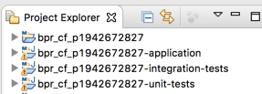
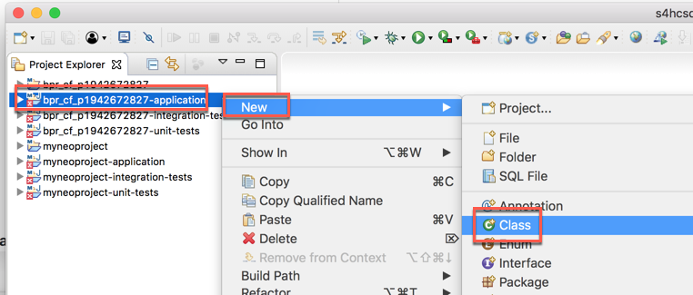
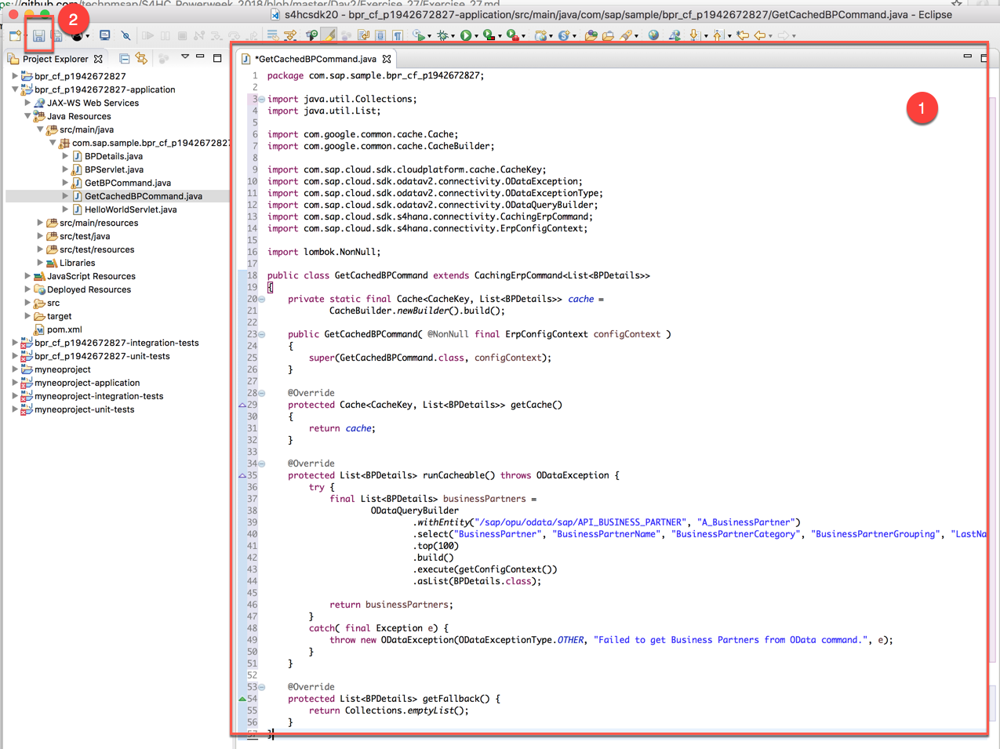
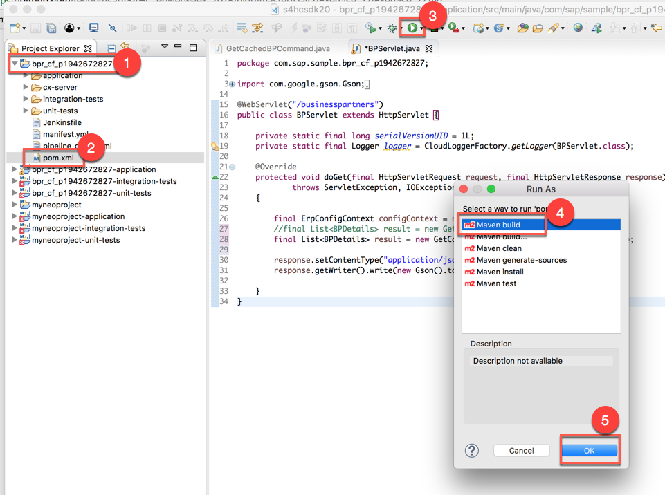
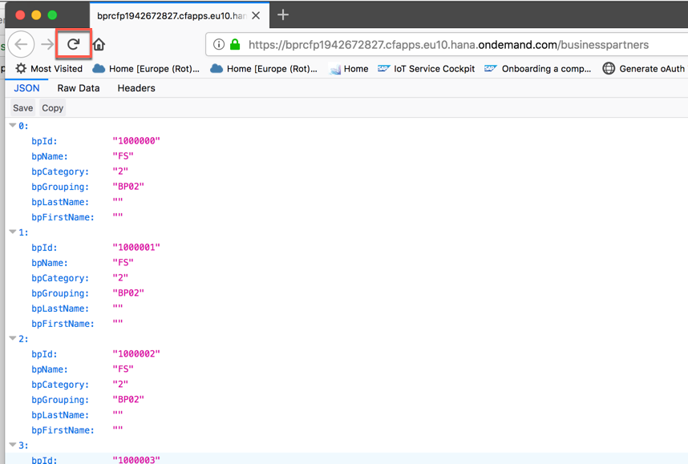
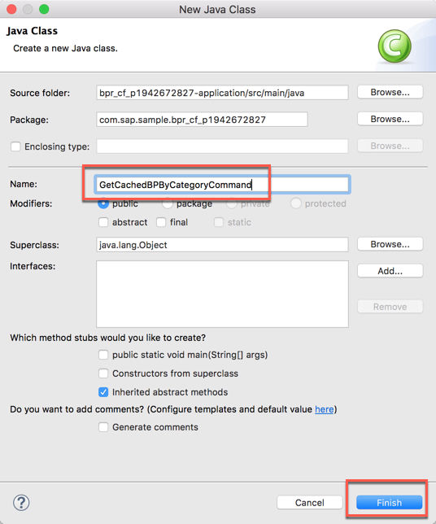
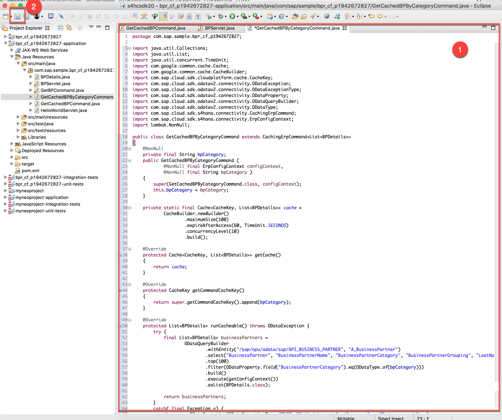
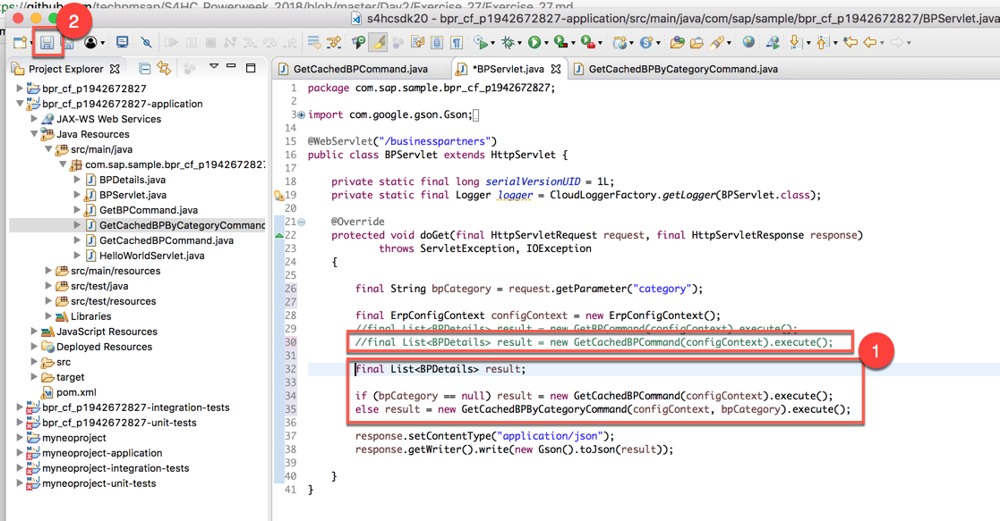
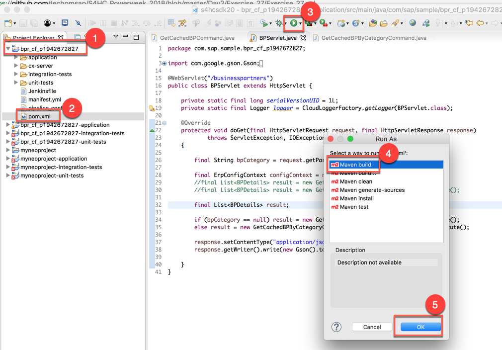
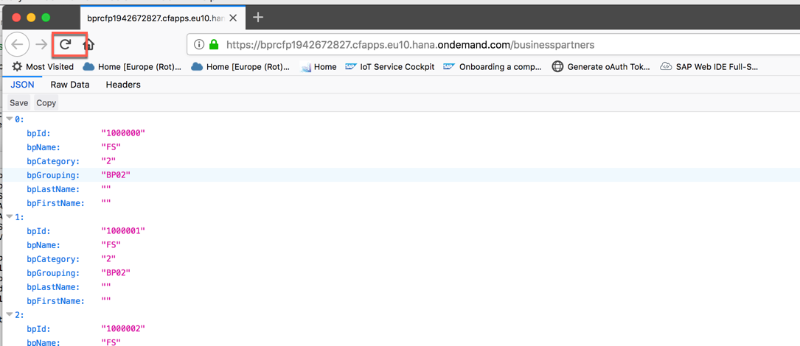

<table width=100% border=>
<tr><td colspan=2><h1>EXERCISE 2_7 - ADD A CACHING MECHANISM TO YOUR APPLICATION</h1></td></tr>
<tr><td><h3>SAP Partner Workshop</h3></td><td><h1> &nbsp;30 min</h1></td></tr>
</table>


## Description
In this exercise, you’ll learn how 

* to implement caching in your application using the SAP S/4HANA Cloud SDK
* to implement filtering on Business Partner Category in the cached command

A cache generally works by the action of requesting information to a given subject, called **key**. If an information to a given key was previously requested, since stored and now available to read, a so called “cache hit” occurs: the data can be found and will be loaded. A “cache miss” occurs when it cannot.

The most important aspects of caches are their size and their item life time. Both should be limited with regards to the use case, to avoid an outdated state or disproportionate memory consumption in the application. The biggest effect of using a cache can be perceived, when the application is repetitively reading larger chunks of data from external sources. Then the fraction of bandwidth required for transmitting information will be reduced effectively.

Caching is applicable whenever:

- You are willing to spend some memory to improve speed
- You expect that keys will sometimes get queried more than once
- Your cache will not need to store more data than what would fit in RAM. (By default, the cache is local to a single run of your application. It does not store data in files, or on outside servers).

If each of these options apply to your use case, then we highly recommend the caching features provided by SAP S/4HANA Cloud SDK.

The command cache allows parallel execution and asynchronous computation for efficient programming practices. Stored information is organized as a local key-value store. For each unique key the same response is expected in case of a “cache hit”. Otherwise the cache response will be computed.

As underlying technology [Guava](https://github.com/google/guava) is being used, which gives you options to customize the cache configuration.

For further reading on SAP S/4HANA Cloud SDK, click link below.
<https://www.sap.com/germany/developer/topics/s4hana-cloud-sdk.html>


## Target group

* Developers
* People interested in learning about S/4HANA extension and SDK  


## Goal

The goal of this exercise is to implement caching in your application using the SAP S/4HANA Cloud SDK.  

## Prerequisites
  
Here below are prerequisites for this exercise.

* A trial account on the SAP Cloud Platform. You can get one by registering here <https://account.hanatrial.ondemand.com>
* Apache Maven
* Java JDK 8
* The source code created in the previous exercise
* A S/4HANA system with a working communication arrangement for the Business Partners collection


## Steps

1. [Caching mechanism implementation](#caching-implementation)
1. [Enabling filtering for cached queries](#enabling-filtering)


### <a name="caching-implementation"></a>Caching mechanism implementation
In this chapter you are going to see how to implement caching in your application. You will be creating a new class, named **GetCachedBPCommand**, which inherits from CachingErpCommand, which, in its turn, is the SDK’s abstraction to provide easy to use cacheable Hystrix commands. To implement a valid CachingErpCommand we need to do the three things:

- **Provide a constructor**: here we simply add a constructor that takes an ErpConfigContext as parameter.
- **Override the runCacheable() method**: as you might have noticed already, we can simply take the code we used to call our OData service from the previous exercise, and put it into the method. You can even specify Java exceptions. So no changes are needed!
- **Override the getCache() method**: since it might be possible for you to use any cache utility, you need to instantiate the Cache object yourself and provide a method for the internal usage.

1. Open Eclipse IDE and load the project created in the previous exercise  
	

1. Locate the **application** module and, right clicking on it, select **New -> Class**  
	

1. Create a new Java class named **GetCachedBPCommand** and click **Finish**  
	

1. Replace the **GetCachedBPCommand** class with the following code and **save** the file (don't change the first line which contains the package name) 

	```java
	import java.util.Collections;
	import java.util.List;
	
	import com.google.common.cache.Cache;
	import com.google.common.cache.CacheBuilder;
	
	import com.sap.cloud.sdk.cloudplatform.cache.CacheKey;
	import com.sap.cloud.sdk.odatav2.connectivity.ODataException;
	import com.sap.cloud.sdk.odatav2.connectivity.ODataExceptionType;
	import com.sap.cloud.sdk.odatav2.connectivity.ODataQueryBuilder;
	import com.sap.cloud.sdk.s4hana.connectivity.CachingErpCommand;
	import com.sap.cloud.sdk.s4hana.connectivity.ErpConfigContext;
	
	import lombok.NonNull;
	
	public class GetCachedBPCommand extends CachingErpCommand<List<BPDetails>>
	{
	    private static final Cache<CacheKey, List<BPDetails>> cache =
	            CacheBuilder.newBuilder().build();
	
	    public GetCachedBPCommand( @NonNull final ErpConfigContext configContext )
	    {
	        super(GetCachedBPCommand.class, configContext);
	    }
	
	    @Override
	    protected Cache<CacheKey, List<BPDetails>> getCache()
	    {
	        return cache;
	    }
	
	    @Override
	    protected List<BPDetails> runCacheable() throws ODataException {
	        try {
	            final List<BPDetails> businessPartners =
	                    ODataQueryBuilder
	                            .withEntity("/sap/opu/odata/sap/API_BUSINESS_PARTNER", "A_BusinessPartner")
	                            .select("BusinessPartner", "BusinessPartnerName", "BusinessPartnerCategory", "BusinessPartnerGrouping", "LastName","FirstName")
	                            .top(100)
	                            .build()
	                            .execute(getConfigContext())
	                            .asList(BPDetails.class);
	
	            return businessPartners;
	        }
	        catch( final Exception e) {
	            throw new ODataException(ODataExceptionType.OTHER, "Failed to get Business Partners from OData command.", e);
	        }
	    }
	
	    @Override
	    protected List<BPDetails> getFallback() {
	        return Collections.emptyList();
	    }
	}
	```
	

1. Now we need to adapt the old **BPServlet** class to use this new command. Open the *BPServlet.java* class   

1. In the **doGet** method, replace (or just comment) the line
	
	```java
	final List<BPDetails> result = new GetBPCommand(configContext).execute();
	```
	with

	```java
	final List<BPDetails> result = new GetCachedBPCommand(configContext).execute();
	```
	
1. This is how the new **BPServlet** class should look like. Save the file

	
	
1. Expand the **root** module of your project and select the *pom.xml* file. Then click on the small play button on the toolbar. Select the **Maven build** goal and click **OK**  
	

1. Specify the **clean install** goals if required and click **Run**  

1. Building should end with a BUILD SUCCESS message  
	

1. Open Terminal and enter the `cf push` command to deploy the application to Cloud Foundry  
	

1.  Refresh the browser page where you have your application URL and check that the service is still providing the expected results  
	

1. Congratulations! You have successfully implemented caching in your application using the SAP S/4HANA Cloud SDK.


### <a name="enabling-filtering"></a>Enabling filtering for cached queries
In this chapter you are going to add filtering capabilities to the cached queries. In particular, you are going to implement a filter on Business Partner Category. This filter is passed as a URI string parameter and the cache will dynamically adapt the provided key to your parameter delivery.

1. Locate the **application** module and, right clicking on it, select **New -> Class**  
	

1. Create a new Java class named **GetCachedBPByCategoryCommand** and click **Finish**  
	

1. Replace the **GetCachedBPByCategoryCommand** class with the following code and **save** the file (don't change the first line which contains the package name)

	```java
	import java.util.Collections;
	import java.util.List;
	import java.util.concurrent.TimeUnit;
	import com.google.common.cache.Cache;
	import com.google.common.cache.CacheBuilder;
	import com.sap.cloud.sdk.cloudplatform.cache.CacheKey;
	import com.sap.cloud.sdk.odatav2.connectivity.ODataException;
	import com.sap.cloud.sdk.odatav2.connectivity.ODataExceptionType;
	import com.sap.cloud.sdk.odatav2.connectivity.ODataProperty;
	import com.sap.cloud.sdk.odatav2.connectivity.ODataQueryBuilder;
	import com.sap.cloud.sdk.odatav2.connectivity.ODataType;
	import com.sap.cloud.sdk.s4hana.connectivity.CachingErpCommand;
	import com.sap.cloud.sdk.s4hana.connectivity.ErpConfigContext;
	import lombok.NonNull;
	
	public class GetCachedBPByCategoryCommand extends CachingErpCommand<List<BPDetails>>
	{
	    @NonNull
	    private final String bpCategory;
	    public GetCachedBPByCategoryCommand (
	            @NonNull final ErpConfigContext configContext,
	            @NonNull final String bpCategory )
	    {
	        super(GetCachedBPByCategoryCommand.class, configContext);
	        this.bpCategory = bpCategory;
	    }
	
	    private static final Cache<CacheKey, List<BPDetails>> cache =
	            CacheBuilder.newBuilder()
	                    .maximumSize(100)
	                    .expireAfterAccess(60, TimeUnit.SECONDS)
	                    .concurrencyLevel(10)
	                    .build();
	
	    @Override
	    protected Cache<CacheKey, List<BPDetails>> getCache()
	    {
	        return cache;
	    }
	
	    @Override
	    protected CacheKey getCommandCacheKey()
	    {
	        return super.getCommandCacheKey().append(bpCategory);
	    }
	
	    @Override
	    protected List<BPDetails> runCacheable() throws ODataException {
	        try {
	            final List<BPDetails> businessPartners =
	                    ODataQueryBuilder
	                            .withEntity("/sap/opu/odata/sap/API_BUSINESS_PARTNER", "A_BusinessPartner")
	                            .select("BusinessPartner", "BusinessPartnerName", "BusinessPartnerCategory", "BusinessPartnerGrouping", "LastName","FirstName")
	                            .top(100)
	                            .filter(ODataProperty.field("BusinessPartnerCategory").eq(ODataType.of(bpCategory)))
	                            .build()
	                            .execute(getConfigContext())
	                            .asList(BPDetails.class);
	
	            return businessPartners;
	        }
	        catch( final Exception e) {
	            throw new ODataException(ODataExceptionType.OTHER, "Failed to get CostCenters from OData command.", e);
	        }
	    }
	
	    @Override
	    protected List<BPDetails> getFallback() {
	        return Collections.emptyList();
	    }
	}
	```
	

	You see the following changes, compared to the simple cached-command example:
	
	- The constructor features a second parameter, a String representation of a Business Partner Category parameter. This parameter is used in the OData query.
	
	- The cache instance now defines:
	
		| description | explanation |
		| ----------  | ----------- |
		| maximum item size of 100 | Up to a hundred Business Partners queries and their responses will be cached |
		| expiration after 60 seconds | The item associated to any key which is older than a minute will be re-requested by the command |
		| concurrency level of 10|This value provides a hint for the underlying caching API to estimate the number of threads trying to write into and change the cache at the same time. Concurrent reading access will be unaffected from this setting |
	
	- New methods have been overridden:
	
		| description | explanation |
		| ----------  | ----------- |
		| getCommandCacheKey() | It does append the provided **bpCategory** to the cacheKey, thus making it distinguishable from the same service calls but with different **bpCategory** parameter |
		| getCommandFallback() |	In case the **runCachable** procedure fails in any way, we provide a fallback solution. In this example we return an empty list object |
	

1. It's necessary now to adapt again the **BPServlet** class so that it can properly use this new command. First of all add a new **bpCategory** variable at the beginning of the **doGet** method

	```java
	final String bpCategory = request.getParameter("category");
	``` 
	

1. Then, pay attention also to another question: you must detect if the user is providing or not the category value along with the URI string. If you didn't do this and you simply adjusted the **BPServlet** class by changing the line where the command is called in this way `final List<BPDetails> result = new GetCachedBPByCategoryCommand(configContext, bpCategory).execute();`, this would break the integration tests, because during the tests the **bpCategory** variable would be **NULL**. So to workaround this you need to replace (or just comment) the line

	```java
	final List<BPDetails> result = new GetCachedBPCommand(configContext).execute();
	```

	with this block

	```java
	final List<BPDetails> result;
	
	if (bpCategory == null) result = new GetCachedBPCommand(configContext).execute();
	else result = new GetCachedBPByCategoryCommand(configContext, bpCategory).execute();
	```
	where we check
	- if the **bpCategory** variable is **NULL**, we use the command **without** the parameter
	- if the **bpCategory** variable is **NOT NULL**, we use the new command **with** the **bpCategory** parameter. 

	Remember to **save** the file  
	

1. Now you can build the project: expand the **root** module of your project and select the *pom.xml* file. Then click on the small play button on the toolbar. Select the **Maven build** goal and click **OK**  
	

1. Specify the **clean install** goals if required and click **Run**  

1. At the end of the execution, you should receive a BUILD SUCCESS message. Of course, this operation also performs the required integration tests  
	

1. Run again a `cf push` command to deploy to Cloud Foundry  
	

1. Finally, if you refresh the page in the browser with your application URL, you get the old list of Business Partners as expected    
	

1. Instead, if you append to the current URL the filter string "**?category=1**", you get the list of top 100 Business Partners, this because in the GetCachedBPByCategoryCommand there is the filter "top(100)", having Business Partner Category equal to 1    
	

1. Congratulations! You have successfully added filtering capabilities to your cached command using the SAP S/4HANA Cloud SDK.


## Summary
This concludes the exercise. You should have learned how to implement caching in your application using the SAP S/4HANA Cloud SDK and how to implement filtering on Business Partner Category in the cached command. Please proceed with the next exercise.
