<table width=100% border=>
<tr><td colspan=2></td></tr>
<tr><td colspan=2><h1>EXERCISE 3_1 - ML APIs Exploration</h1></td></tr>
<tr><td><h3>SAP Partner Workshop</h3></td><td><h1> &nbsp;20 min</h1></td></tr>
</table>


## Description
In this exercise, you’ll learn how 

* to consume pretrained SAP Leonardo Machine Learning services from SAP API Business Hub sandbox in a SAPUI5 application

## Target group

* Developers
* People interested in SAP Leonardo and Machine Learning 


## Goal

In this exercise you can experience how easy it is to use the available SAP Leonardo Machine Learning foundation services on SAP API Business Hub. The models are already pre-trained and can be tried out on the web page.


## Prerequisites
  
Here below are prerequisites for this exercise.

* A trial account on the SAP Cloud Platform. You can get one by registering here <https://account.hanatrial.ondemand.com>
* Download the files [DFE_articles.zip](files/DFE_articles.zip?raw=true) and [test_images.zip](files/test_images.zip?raw=true) and save them in a proper location: they will be used later in this document.


## Steps

1. [Use SAP Leonardo ML Topic Detection on API Business Hub](#topic-detection)
1. [Use SAP Leonardo ML Image Classification on API Business Hub](#image-classification)

 

### <a name="topic-detection"></a> Use SAP Leonardo ML Topic Detection on API Business Hub
1. Open SAP Business Hub in your browser <https://api.sap.com> and switch to **Classic Design**  
	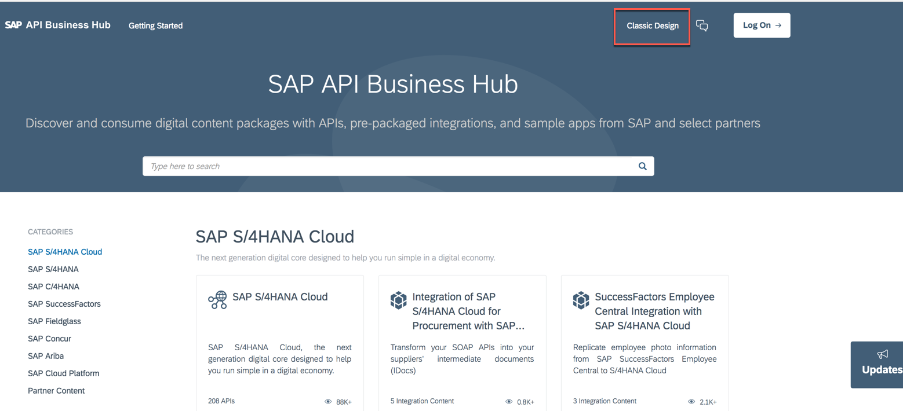

	>NOTE: Please use Firefox to avoid the SSO login [for SAP Employees only].

1. 	Click on **APIs**  
	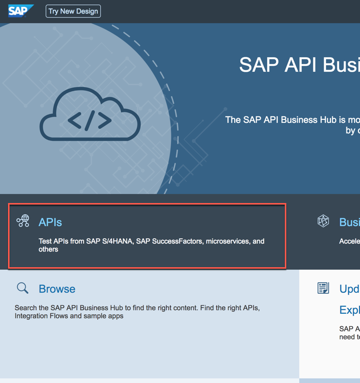

1. 	Choose **SAP Leonardo Machine Learning - Functional Services**  
	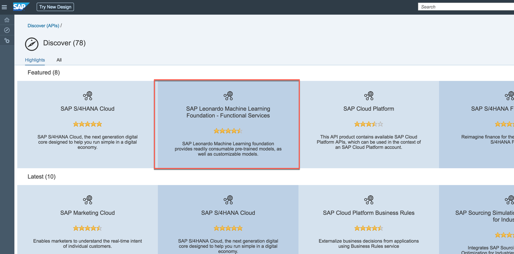

1. 	Choose **Inference Service for Topic Detection**  
	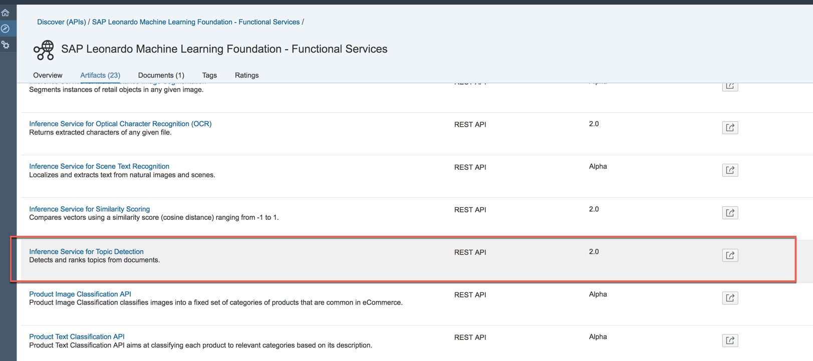

1. We need to login to test the service: click on the **Login** button at the top right corner  
	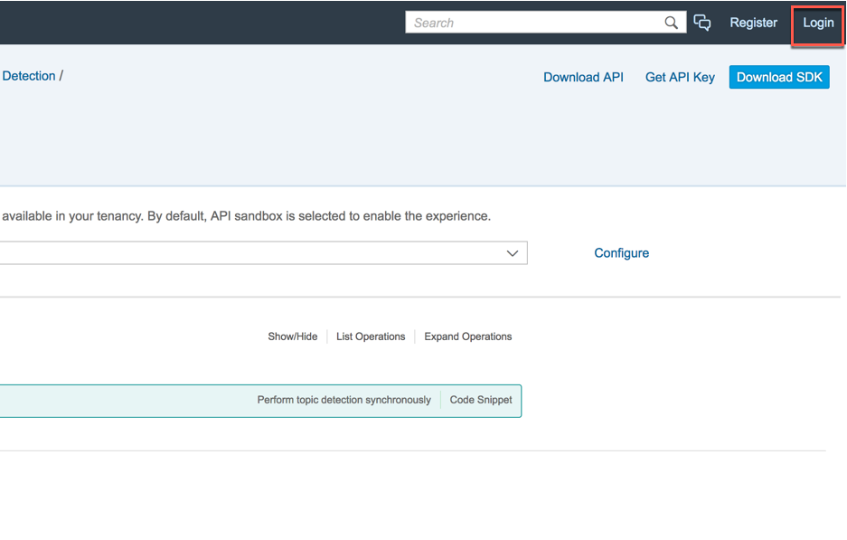

1. Enter the credentials provided by your instructor and click **Log On**  
	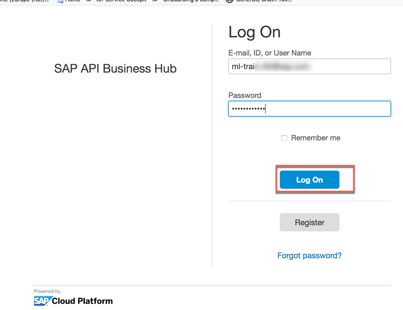

1. Expand the **POST** request **/topic-detection**  
	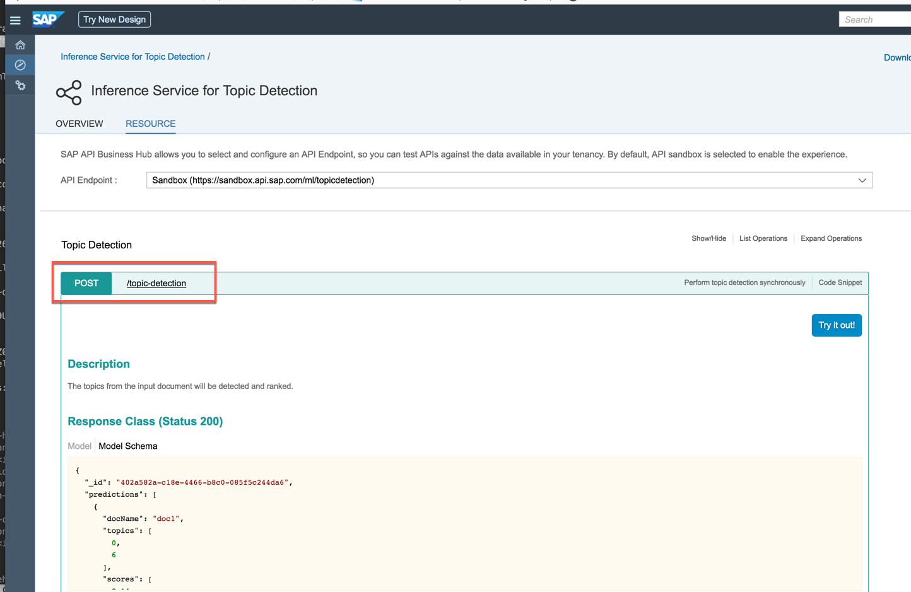

1. Under **files** press the **Browse** button  
	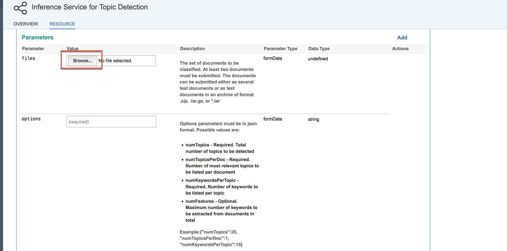

1. Choose the *DFE_articles.zip* file (you have already downloaded it in the prerequisites section) containing some text files  
	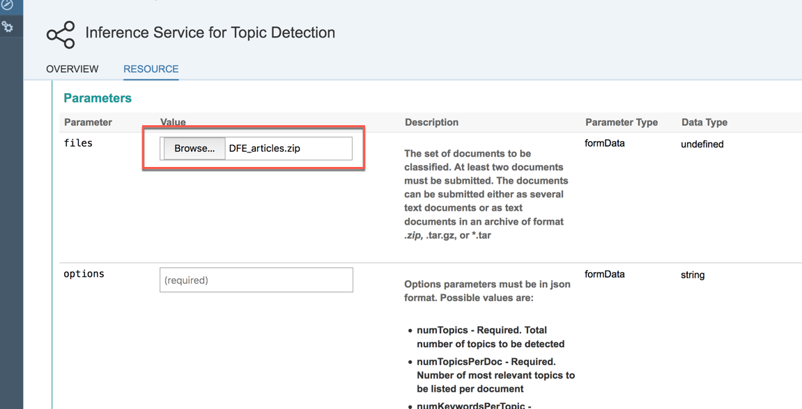

1. Scroll down and under **options**, paste the following parameters and click on the **Try it out!** button  
	
	```json
	{"numTopics":3, "numTopicsPerDoc":2, "numKeywordsPerTopic":15}
	```	
	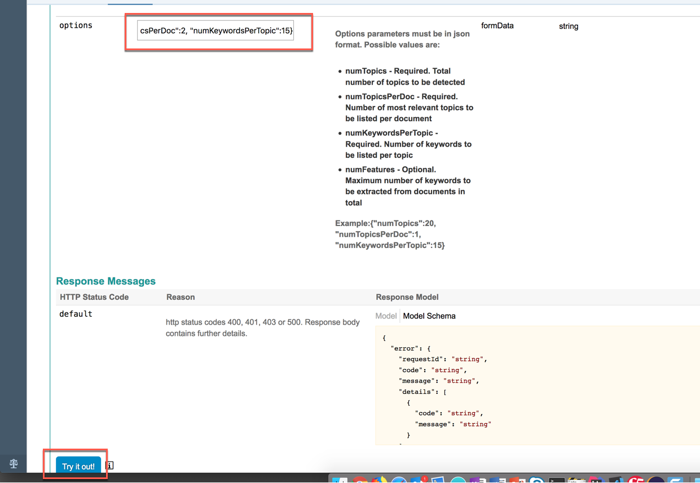

1. You should receive a **Response Code** of **200**. Check the result in the **Response Body**: you should see a content like this  
	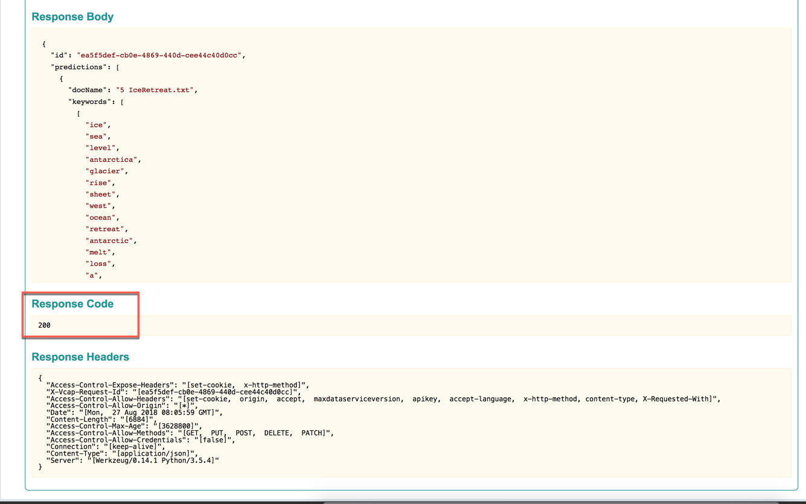

1. Try again by changing the values for **numTopics** to **2** and **numTopicsPerDocs** to **1**  
	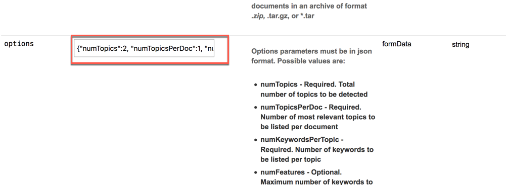

1. What has changed? You should receive an answer similar to this  
	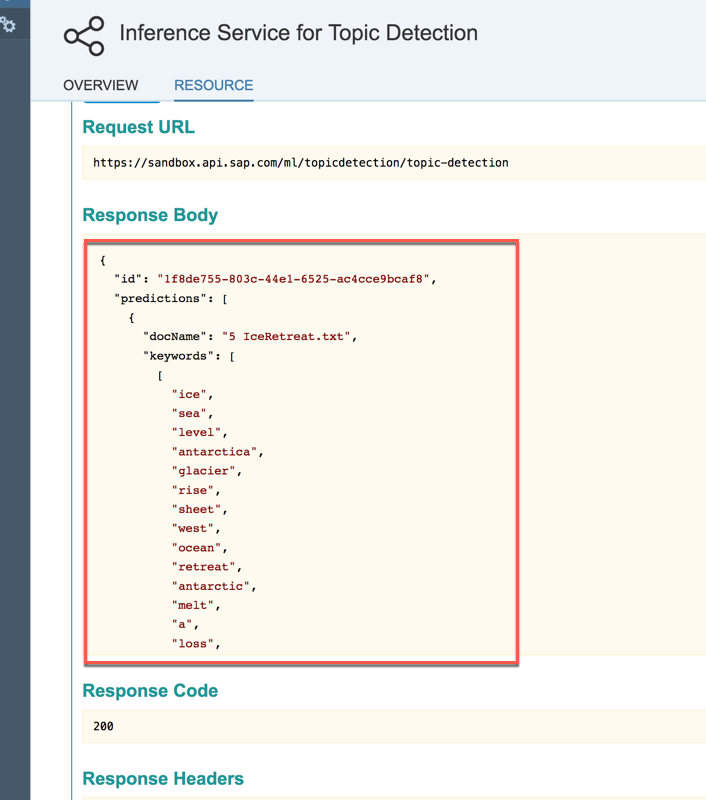

1. You have completed the exercise! You have successfully used the Topic Detection API service to find **numKeywordsPerTopic** keywords and **numTopics** topics across all documents. The topics get a number, starting with 0. So, if you define 3 Topics, they will be numbered with 0, 1, 2. With **numTopicsPerDoc** you define how many of the topics of the entire document corpus can be found in one document. The algorithm chooses the number of topics which fits best and assigns them a score which is not normalized to 1.  


### <a name="image-classification"></a> Use SAP Leonardo ML Image Classification on API Business Hub

1. Go back to the **SAP Leonardo Machine Learning Foundation - Functional Services** page  
	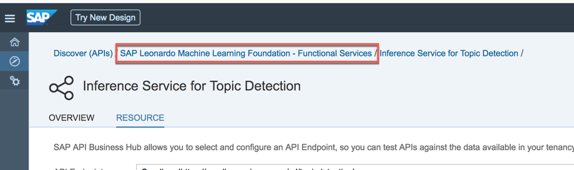

1. 	Expand the **/classification** link and click on **Browse**  
	

1. Choose the *test_images.zip* file (you have already downloaded it in the prerequisites section) and click on the **Try it out!** button  
	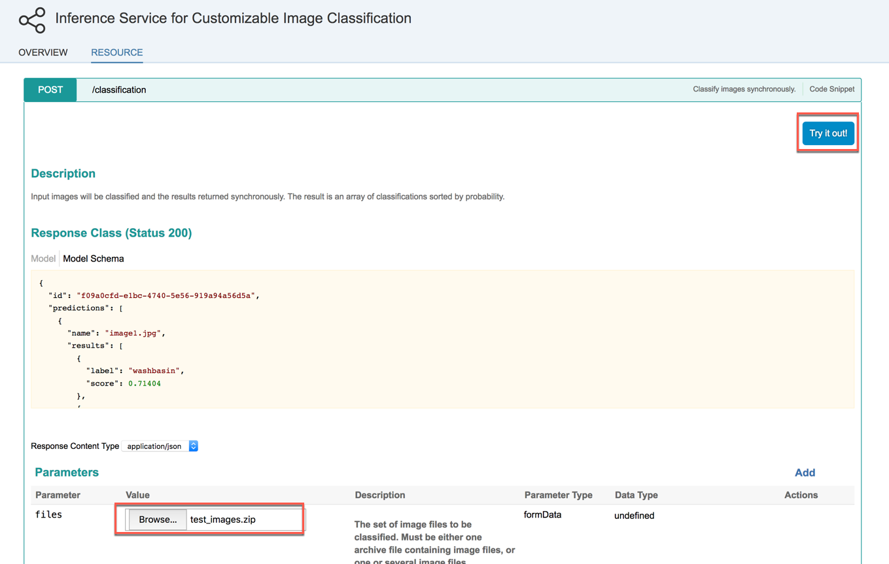

1. Look at the response code: it should be 200, meaning that the request was successful. Then look at the response body: you should be able to read the predictions against the images contained in the zip file you uploaded. For example here you can see that the *iPhoneX.jpg* has been labeled as a "cellular telephone" with a score of 0.47  
	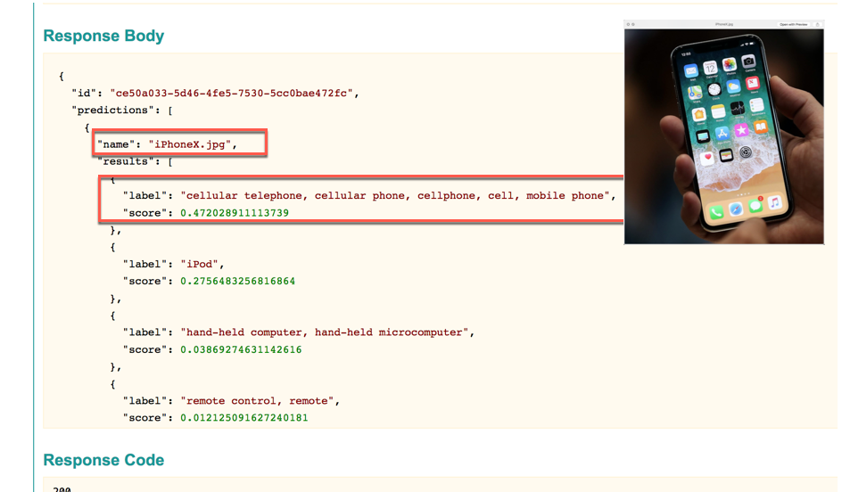

1. Looking down at another image, like the *tennis_ball.jpg* you can see that the it has been correctly labeled as a "tennis ball" with a score of 0.99  
	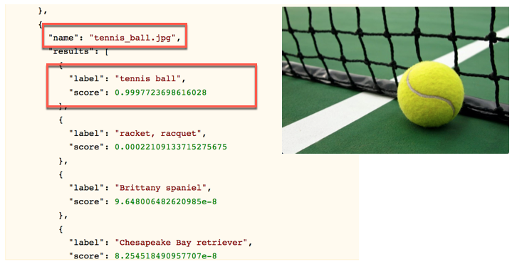

1. Congratulations! You have completed the exercise.


## Summary
This concludes the exercise. You should have learned how to use the available SAP Leonardo Machine Learning foundation services on SAP API Business Hub.

You are now able to:

* Browse through API Business Hub to find the latest functional and business services of SAP Leonardo ML foundation
* Test SAP Leonardo ML foundation services directly on API Business Hub
* Understand the Topic Detection Model.

Please proceed with next exercise.
