<table width="100%" border=>
<tr><td colspan=2></td></tr>
<tr><td colspan=2><h1>EXERCISE 3_5 - Bring your own model</h1></td></tr>
<tr><td><h3>SAP Partner Workshop</h3></td><td><h1> &nbsp;30 min</h1></td></tr>
</table>

## Description
In this exercise you get to experience how easy it is to deploy your machine learning models using SAP Leonardo Machine Learning Foundation services. You will learn how to use the SAP ML Endpoints provided in your service key, that you created for your ML Foundation Service instance. 

If you have multiple models for the same application you can also upload and choose which version you wish to serve. 
>Note: you can not deploy more than one model with the same name.

Afterwards you will deploy your own Cloud Foundry Python app consuming the deployed model to perform inference queries - a so called inference app. For convenience reason we prepared a simple SAPUI5 app for you in order to test your deployed model calling the deployed inference app.


Exercise Description 

- SAP Leonardo ML Foundation BYOM service consumption
-	Login to SAP Cloud Platform - Cloud Foundry environment
-	Create BYOM Service Instance and Service Key (already done in previous exercise)
-	Upload model to ML Foundation Model Repository
-	Deploy your uploaded model 
-	Adjust and deploy your prepared inference app (written in Python) to your Cloud Foundry space
-	Test your new model via prepared SAPUI5 application deployed to your Cloud Foundry space
 


## Target group

* Developers
* People interested in SAP Leonardo and Machine Learning 


## Goal

The goal of this exercise is to understand how to deploy your own ML model using the SAP Leonardo ML Foundation Services and test the deployed model.


## Prerequisites
  
Here below are prerequisites for this exercise.

* You must have completed previous exercises
* An account on <https://account.hana.ondemand.com>. The credentials will be provided by your instructor
* The [mnist.zip](files/mnist.zip?raw=true)
* A folder with the unzipped inference app [inference\_app.zip](files/inference_app.zip?raw=true)
* A folder with the unzipped test image files [test\_images\_byom.zip](files/test_images_byom.zip?raw=true)


## Steps

1. [Upload and deploy your model](#upload-deploy-model)
1. [Test your new Model](#test-model)


### <a name="upload-deploy-model"></a> Upload and deploy your model
In this section, you will take a prepared Tensorflow model and upload it to the ML Foundation model repository. After uploading, you will deploy it which will take a few minutes as the docker containers are instantiated for this model.
	
1.	Navigate in the SCP Cloud Foundry Cockpit to your **Service Key**. Select the **Model Repo URL** and copy it  
	

1.	Open a new browser window and paste the copied URL. A Swagger UI is opened up  
	

	>Note: it might change in the future	 

1.	Open the branch **model-versions-controller-impl** and select the **POST** request  	
	 
1.	This UI provides the function to upload your own model. Enter the following parameters:

	| Parameter | Value |
	| --------- | ----- |
	| modelName | enter a name of your choice, for example **mnist\_model\_XX** where **XX** is your workstation ID |
	| File | select the [mnist.zip](files/mnist.zip?raw=true) file you have downloaded in the prerequisites |
	| Authorization | enter your token generated with the Access Token tool |  

	Click on **Try it out!** to upload your model  	
	 
1. While the file is getting uploaded to the server, you will get a small progress bar on the right side at the bottom of the screen  
	

1. At the end of the process, which could also take a few minutes, you should get a **Response Code** of **201**  
	

1.	In the Response Body you should get an answer like the one in the screenshot where you can read the **modelName** and the **version**. Write down these two because you will need it in the next steps when we will deploy the model to the ML Foundation model repository  
	
	 
1.	Navigate in the SCP Cloud Foundry Cockpit to your Service Key. Select the **DEPLOYMENT\_API\_URL** and copy it in the clipboard	 
	

1.	Open a new browser window and paste there the copied Deployment API URL. A Swagger UI is opened up  
	
	
	>Note: it might change in the future	 
	 
1.	Select the **model-server-controller - POST** method  
	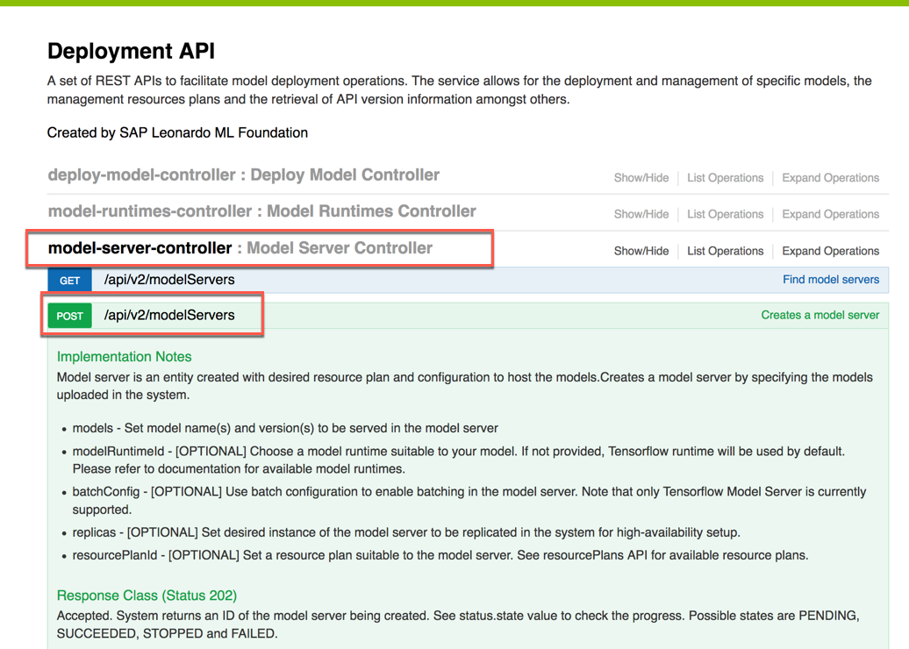

1.	This UI provides the function to deploy the model you have uploaded previously. Enter the modelServerSpecsRequest parameter as the following

	```json
	{
	  "specs": {
	    "enableHttpEndpoint": false,
	    "modelRuntimeId": "tf-1.3",
	    "models": [
	      {
	        "modelName": "%MODELNAME%",
	        "modelVersion": "%MODELVERSION%"
	      }
	    ],
	    "replicas": 1,
	    "resourcePlanId": "cpu-small_1_4"
	  }
	}
	```
	where you have to replace the variable **%MODELNAME%** with your Model name and **%MODELVERSION%** with your Model version. You retrieved this information in the previous step.
	Then you have to specify the Authorization code generated with the tool located here <https://generate_ml_token.cfapps.eu10.hana.ondemand.com/>
	
	When done, click on **Try it out!** to deploy your model  	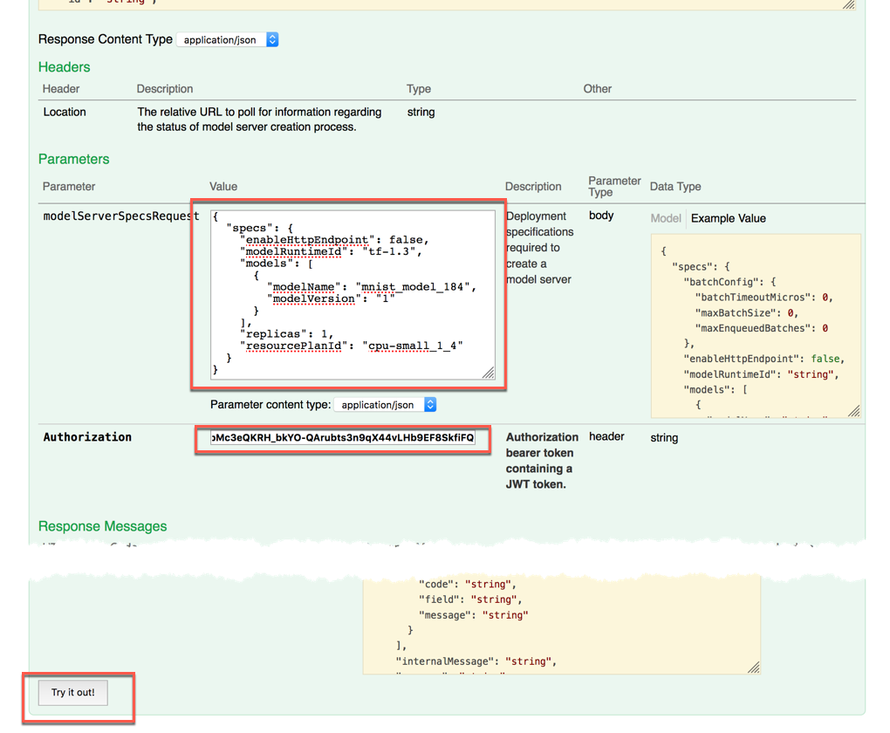


1.	You will get a Response Body similar to the one in the screenshot. The status will be **PENDING** at the beginning and the Response Code will be **202**. Copy in the clipboard the ID you see at the beginning of the response body  
	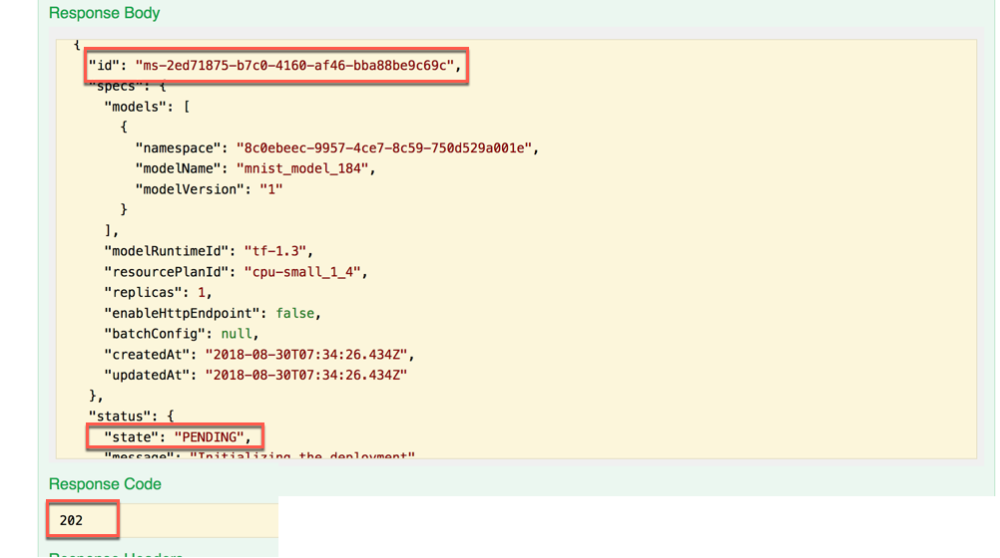

1.	Within the same **model-server-controller** API, select now the **GET** method. Enter the following parameters and click on the **Try it out!** button to check the deployment status

	| Parameter | Value |
	| --------- | ----- |
	| modelServerId | the string you copied in the clipboard in the previous step |
	| Authorization | the token generated with the Access Token tool |  

	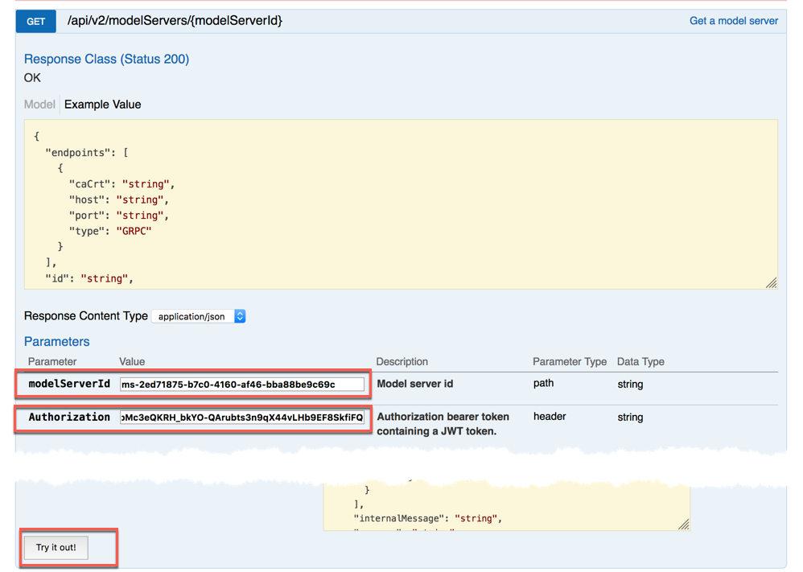

1.	Initially you might still get the **PENDING** status: please repeat that step until you get a response with the **deploymentStatus** as **SUCCEEDED**. Please keep this window open as you need some information in the next step  
	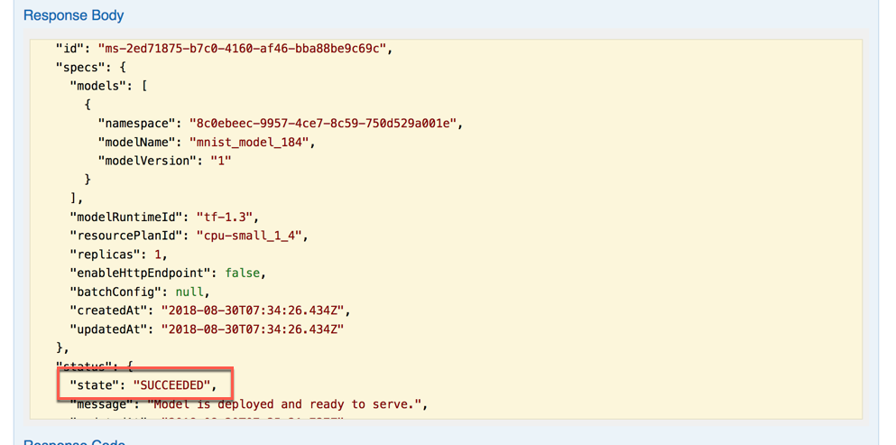


### <a name="test-model"></a> Test your new model
In this section, you will push an application that we have already prepared for you to Cloud Foundry. This in order to test your new model.

1. Download the [inference_app.zip](files/inference_app.zip?raw=true) and extract it in a proper folder on your machine  
	

1. Open the *manifest.yml* file with your favourite editor: it should look like this  
	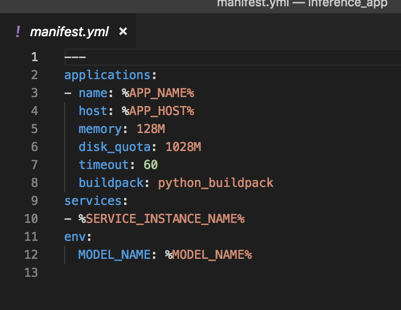
	
	>NOTE: this is a very "sensible" file in the sense that you need to pay attention to its formatting otherwise pushin the app to Cloud Foundry won't work

1.	Replace the variables in the following way

	| Parameter | Value |
	| --------- | ----- |
	| %APP\_NAME% | the name you want to give to the Cloud Foundry application (i.e. byom\_app\_XX) |
	| %APP\_HOST% | the host name you want to give to the Cloud Foundry application (i.e. byom\_host\_XX) |
	| %SERVICE\_INSTANCE\_NAME% | the name of ML Foundation instance you have created in the first exercises (i.e. ml\_instance\_XX) |
	| %MODEL\_NAME% |the name of the model you have just deployed (i.e. mnist\_model\_XX) | 
	 
	Remember to replace **XX** with your workstation ID. If you have followed the naming convention we have used so far, you just need to replace the XX placeolder in this file. Once done, save and close the file  

	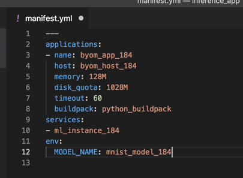

1.	In order to deploy your Python inference app to your Cloud Foundry space, open a Terminal window and go to the folder where you have extracted the inference app

1. Check that you are in the proper space by entering the commands
	
	```sh
	cf api
	cf apps
	```

	If not, you need to login again with the command 

	```sh
	cf login -a <YOUR_API_ENDPOINT>  -u <YOUR_CLOUD_FOUNDRY_USER>
	```
where **\<YOUR\_API\_ENDPOINT\>** is the hostname you can read when you go inside your subaccount on your Cloud Platform environment and **\<YOUR\_CLOUD\_FOUNDRY\_USER\>** is the username provided by your instructor. When running this command you will be requested to enter the related password and to choose the right organization. Please choose the organization named **ml\_train\_XX** where **XX** is your workstation ID  
	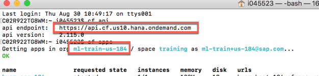

1. Run the following command in this folder. The Python app is pushed to SAP Cloud Foundry according to the information specified in the *manifest.yml* file 

	```sh
	cf push
	```   
	

1.	At the end of the process (it might take a while), you will get a message like this where the application is shown as running. Copy in the clipboard the URL you get at the end of this process  
	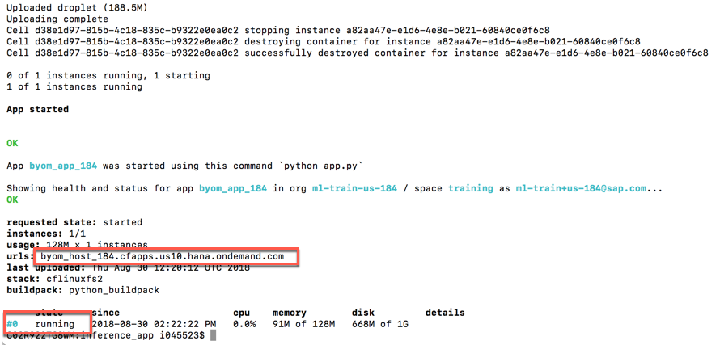

1. Open the internet browser, type "https://" and paste there the string you have in the clipboard. A new application is opened. Click on the **Browse...** button  
	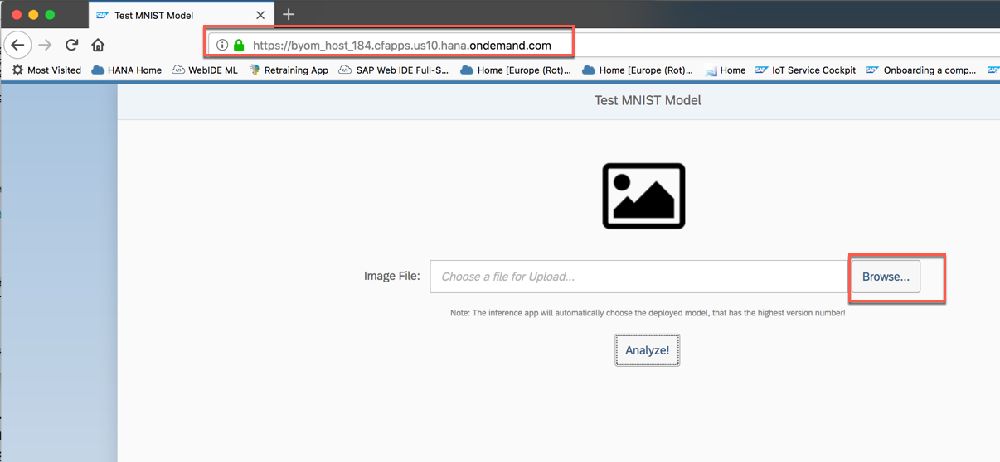

1. Get one of the test images you have already downloaded and extracted previously (i.e. 7.jpg) and click on the **Analyze!** button  
	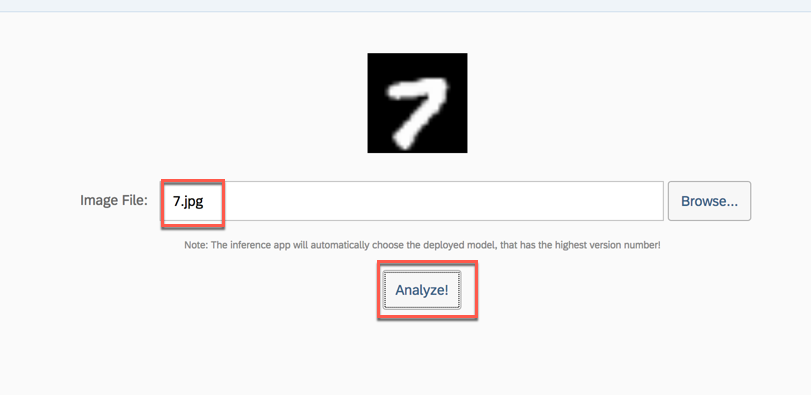

1. The image is analyzed according to your new model and the correct result is displayed  
	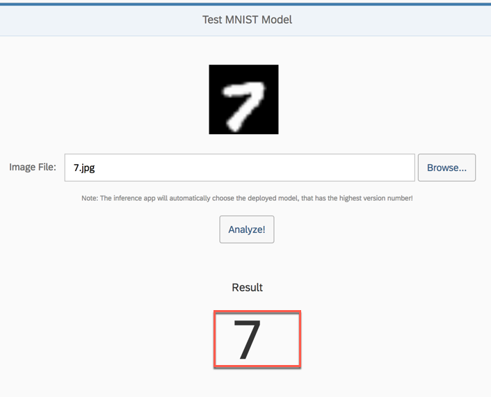
	
1. You have successfully completed the exercise.


## Summary
You have completed the exercise!
 
You are now able to: 

* Use the service key to retrieve the ML Foundation API endpoints
* Upload your Model using the Model API
* Deploy your Model using the Deployment API
* Check the status of your Model Deployment
* Create and deploy an inference app (written in Python) to your Cloud Foundry space
* Test your newly deployed model

Please proceed with next exercise.
